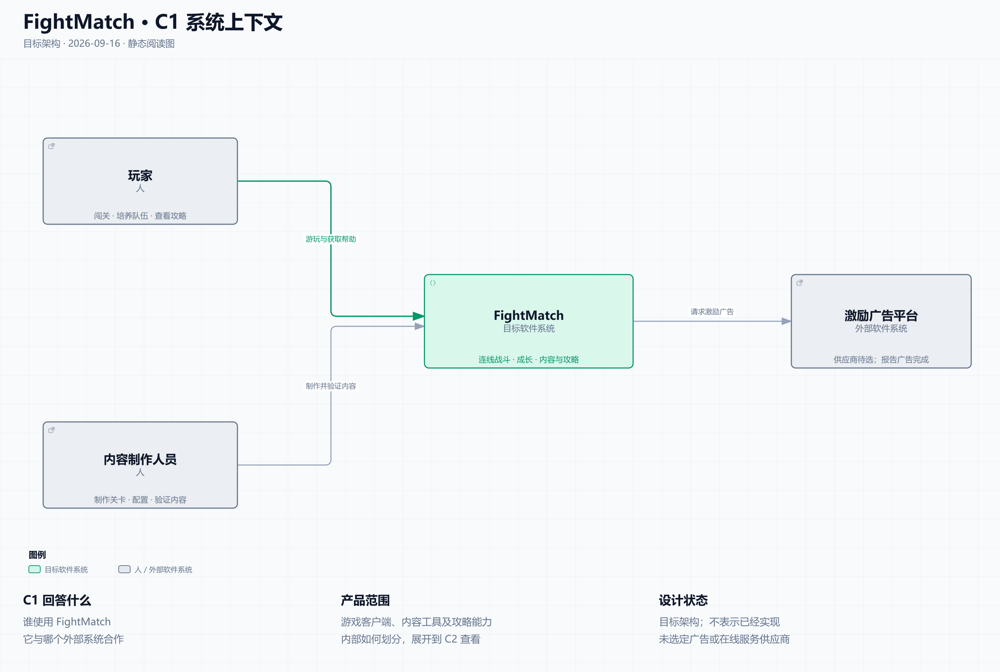
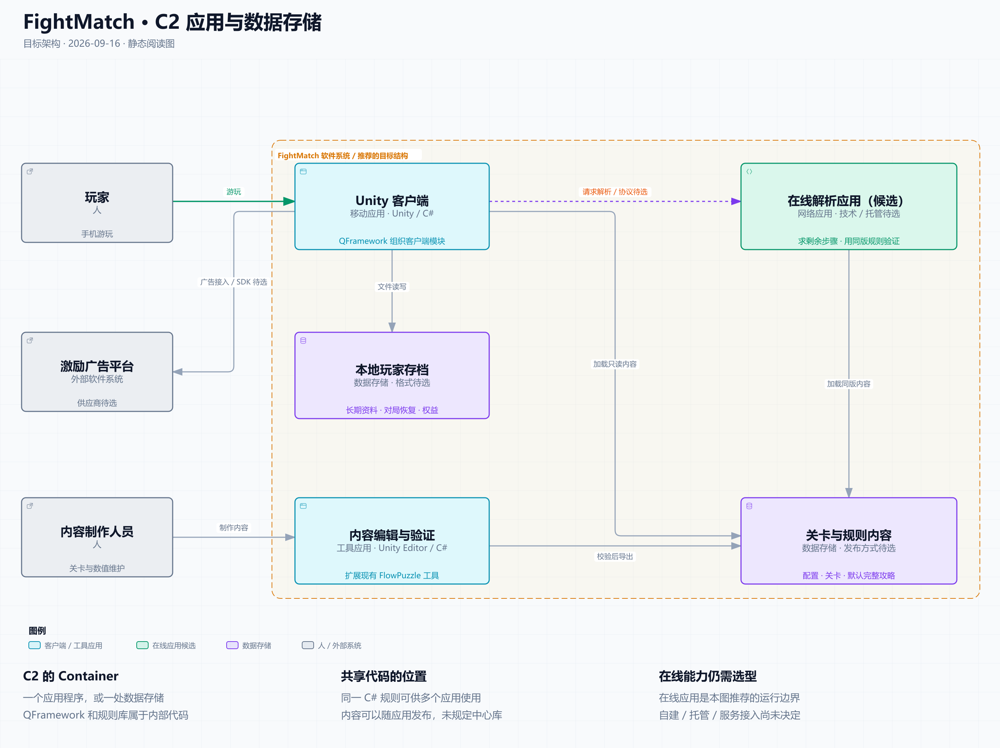
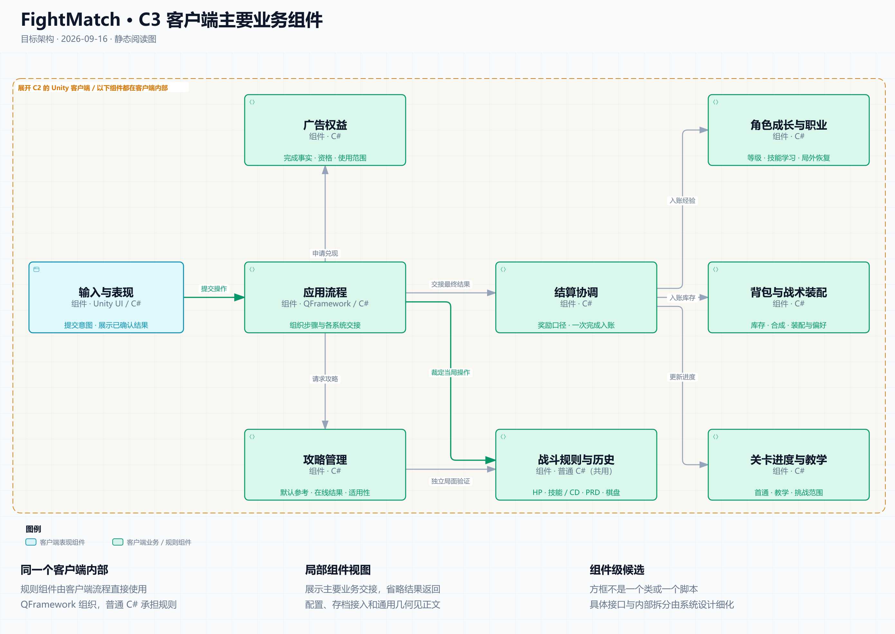

# FightMatch · 用 C4 看整体架构

2026-09-16 · 目标架构视图。依据[系统协作基线 r1](../review.md)整理，用于进入统一系统设计前的阅读；在线运行边界及组件拆分仍是推荐方案，不表示已经实现。

**最新阅读入口：[更新、账号与云存档扩展 r2](r2/README.md)。** 新 C2 补充当前应用与存储边界，新 C3 展开三项新增职责；本页原 C1／C3 继续解释外部关系和游戏业务。原 C2 保留供追溯，不能当作已覆盖热更新、账号和云存档的现行完整图。

C4 用逐层放大的方式描述架构：**整个软件系统 → 应用与数据存储 → 一个应用内部的组件 → 一个组件内部的代码**。每次展开上一层的一个方框，所以不会把产品、运行程序、业务模块和类混在同一层。[C4 官方介绍](https://c4model.com/)

| 层级 | 这一层回答什么 | FightMatch 对应内容 | 当前阅读入口 |
| --- | --- | --- | --- |
| C1 · Context | 谁使用产品？它与哪些外部系统合作？ | 玩家、内容制作人员、FightMatch、激励广告平台 | [C1 交互图](c1-context.html) |
| C2 · Container | 产品由哪些应用与数据存储组成？它们如何交互？ | Unity 客户端、内容工具、在线解析应用候选、本地存档与发布内容 | [C2 交互图](c2-containers.html) |
| C3 · Component | 一个应用内部由哪些职责组件协作？ | 展开 Unity 客户端，看应用流程、战斗、成长、背包、进度、结算、权益与攻略 | [C3 交互图](c3-client.html) |
| C4 · Code | 某个组件内部怎样由类、接口等实现？ | 例如战斗内部的技能、行动与历史实现 | 后续按需要设计，当前不绘制 |

这里的 Container 指一个应用程序或数据存储。Component 表示封装相关功能的一组代码；一个方框可以由多个类实现，同一应用中的组件在该应用内运行。C3 和代码层按需要使用，无需为了凑齐四层而提前完成所有类图。[Container 定义](https://c4model.com/diagrams/container)、[Component 定义](https://c4model.com/abstractions/component)、[Code 层用途](https://c4model.com/diagrams/code)

## C1：先看整个产品

这一层把 FightMatch 当成一个软件系统。玩家使用游戏，内容制作人员维护关卡、配置和参考攻略，产品接入外部激励广告平台。此处产品范围包含客户端、内容工具及攻略能力，具体如何运行在 C2 展开。

[打开 C1 交互图](c1-context.html) · [浅色 SVG](c1-context.light.svg) · [深色 SVG](c1-context.dark.svg)

## C2：打开 FightMatch，看应用与数据

橙色边界内是这次推荐的产品结构。Unity 客户端负责玩家实际游玩；内容编辑工具运行在 Unity Editor 中；本地玩家存档与只读内容承担不同用途。

“在线解析应用”用来表达已定的联网分析能力，**独立应用是本图提出的运行边界候选**。自建、托管还是接入现成服务、实际语言与协议均未选定。若最终由外部系统承担，后续应相应调整 C1／C2 的归属，不能把此图当作已批准的服务器部署图。

[打开 C2 交互图](c2-containers.html) · [浅色 SVG](c2-containers.light.svg) · [深色 SVG](c2-containers.dark.svg)

“关卡与规则内容”是同一批已发布内容的逻辑表示：客户端和验证程序需要使用一致依据，可以各自持有发布副本；此图没有要求建立中央在线数据库，也没有要求客户端每次战斗联网读表。存档的文件格式、内容发布方式和编辑来源由后续系统设计决定。

**QFramework 和战斗规则库不在这一层各画成一个应用。** QFramework 组织客户端代码；普通 C# 战斗规则可以直接运行在客户端内，同时由内容工具和在线验证程序复用。代码职责独立与独立运行、独立部署是不同的划分。

## C3：打开 Unity 客户端，看主要业务组件

下面橙色边界里的组件都位于客户端内部。它是针对主要业务协作的局部 C3 视图，仍需由系统设计落实具体对外能力；一个方框不等于一个 MonoBehaviour、QFramework System 或程序集。

[打开 C3 交互图](c3-client.html) · [浅色 SVG](c3-client.light.svg) · [深色 SVG](c3-client.dark.svg)

先读两条关系：

1. **输入与表现 → 应用流程 → 战斗规则与历史**：一次连线进入规则计算，客户端显示得到的结果。技能、CD、被动概率和当局 HP 都在战斗规则的职责内。
2. **应用流程 → 结算协调 → 成长／背包／进度**：战斗结果经流程交接，结算按规则组织各负责者入账；结算不会取得第二份可独立修改的角色经验或库存。

图中省略了结果返回、成长／学习流程对长期资料的请求，以及配置读取、平台／保存接入、通用几何等共性关系。这些职责仍保留在[完整职责与状态表](../review.md)，并非被删去。攻略使用独立验证局面，不把真实玩家正在进行的战斗用作试算对象；客户端是否承担重搜索、在线如何部署由后续方案与性能证据决定。

## 与现有图和下一阶段的关系

原[系统关系图](../systems.html)继续作为跨系统协作总览。它混合展示业务职责、共用能力和数据交接，之前没有声称是严格的 C4 分层图；本次增加明确的层级和范围，让“产品包含哪些应用”和“客户端内部有哪些模块”分别表达。

C4 帮助说明静态结构；多系统冲突仍需用状态归属、调用约束与具体流程检查。因此保留基线中的 18 行状态归属、A01～A12 场景及[系统设计交接的 H01～H10](../../../handoffs/2026-09-16-system-design.md)。进入下一会话后先完善 C3 的对外能力和交互契约，必要时增加时序／状态图；组件内部的完整 UML 留到相应系统详细设计。

当前最值得先看的是：C2 中哪些东西独立运行，以及 C3 中谁拥有长期资料、谁裁定当前战斗。QFramework 继续是客户端采用方向；C4 是表达这些安排的方法，Archify 是绘图工具。

## 图稿与验证

三份图源均通过 Archify showcase **9/9**，组合错误 0、警告 0；已冻结图源并生成 HTML。静态 PNG／SVG 从交付 HTML 中的图形离线生成，适配了静态阅读字号，六张明暗图均已实际查看。

受本会话此前本地页面的浏览器安全限制，本次没有调用浏览器或使用替代浏览器访问路径；这些图像不是浏览器截图。HTML 的响应式布局和交互未在本次验证。完整哈希与证据范围见[交付记录](handoff.json)、[静态图生成收据](static-receipt.json)与[验证说明](validation.md)。
