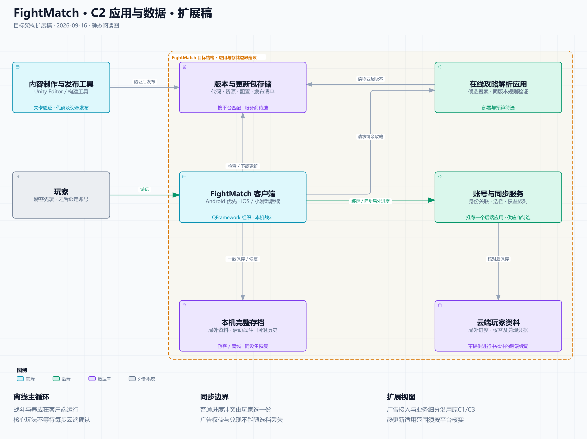
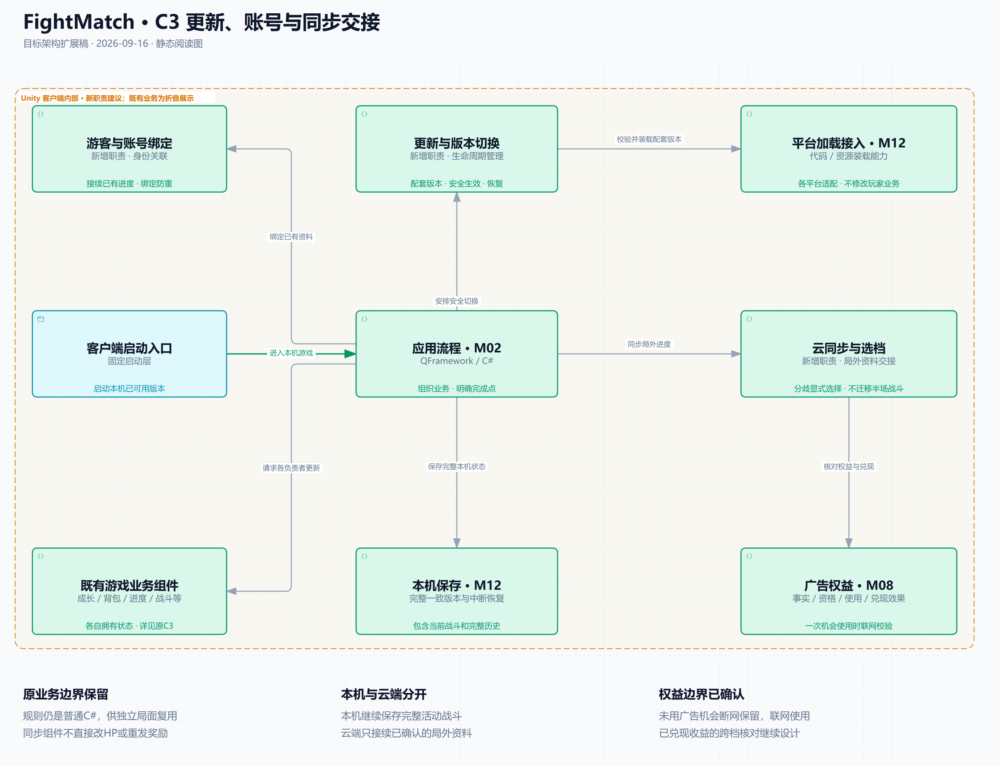

# FightMatch · C4 架构扩展：更新、账号与云存档

2026-09-16图稿r2 · 阅读说明更新2026-09-17 · **架构职责及共同交互首稿已形成，系统详细设计仍需完成。** 本页接收Android优先、内容与代码热更新、游客先玩后绑定、局外进度互通、普通离线游玩及冲突选档的既有决定。一次广告机会联网使用，以及同一张已领广告卡分歧消费只保留所选结果，均已由用户确认；后者不影响不同广告独有收益的保护。

原有战斗、技能、成长、背包、教学和结算划分继续有效。先看下面的 C2，再看 C3；[原 C3](../c3-client.html)继续展开游戏业务。本轮增加三个职责：**更新与版本切换、游客与账号绑定、云同步与选档**。方框是职责边界，不直接规定类、QFramework System 或程序集数量。

## C2：游戏由哪些应用和存储组成

[打开交互图](c2-runtime.html) · [深色图](c2-runtime.dark.png) · [SVG](c2-runtime.light.svg)

客户端运行本机战斗和养成；本机完整存档支持中断恢复。账号与同步服务处理身份关联、进度分歧及广告权益核对，首版推荐一个后端应用，供应商与部署方式尚未选择。云端接续局外资料，不提供另一台设备继续半场战斗的能力。

版本与更新包存储负责发布产物，云端玩家资料负责玩家进度，两者分别失联时也有各自的恢复流程。在线攻略使用匹配版本的规则验证独立局面。箭头表示主要请求，返回资料未重复画线。

橙色区域突出运行时应用和存储；左上方内容制作与发布工具仍属于 FightMatch 的生产工具，不因画在该区域外变成外部供应商。广告平台关系见[原 C1](../c1-context.html)，并未取消。账号提供方、下载服务商及具体渠道选定后再补对应外部系统，不提前虚构品牌或部署。

## C3：客户端怎样接入新增能力

[打开交互图](c3-client-services.html) · [深色图](c3-client-services.dark.png) · [SVG](c3-client-services.light.svg)

| 职责 | 应负责的决定 | 与原系统的约束 |
| --- | --- | --- |
| M14 更新与版本切换 | 识别可用发布集合，安排下载、校验、启用和失败恢复 | M10 仍是配置权威；M12 执行平台加载。不能改玩家进度或把活动战斗绑定换成最新版 |
| M15 游客与账号绑定 | 将原本机资料关联到经过验证的账号，保留绑定与导入结果 | 有云端旧档则复用选档流程；重复绑定不重新发奖。SDK 登录成功不等于进度接入完成 |
| M16 云同步与选档 | 提交可用局外检查点，识别分歧，核对权益，形成明确的选择结果 | 由 M02 组织各状态负责者更新并完成本机保存；同步组件不自行改等级、库存、HP 或首通 |

图中 M12 的加载与保存是同一平台职责的两种能力；“既有游戏业务组件”折叠了原 C3。M08 的“兑现效果”指用于核对的来源与结果凭据，实际成长、发物和结算仍由 M03／M04／M07 负责。普通 C# 战斗规则继续供客户端、内容验证及攻略验证复用，QFramework 组织客户端。

固定启动层先选择可读本机存档的完整代码集合，再进入业务。业务运行期间准备下一版；推荐在明确重启后启用代码更新，不能把回到地图当成已加载程序集可以任意替换。

## 首场景精简，主要内容通过热更新交付

用户明确要求“尽量让首场景精简，最好只放hybridclr和yooasset，大部分内容都通过热更”。据此采用**小启动层＋主要业务热更新**的方向；资源方案仅采用YooAsset，Addressables保留为研究中的替代项，不同时接入。

| 所在位置 | 保留或放入的内容 |
| --- | --- |
| 首场景 | 一个启动入口及最小下载进度、错误、重试显示；其必需的字体等显示资源随包提供。主界面、角色、战斗、地图及各业务System不在首场景提前创建 |
| 随安装包提供的启动层 | Unity／IL2CPP与HybridCLR运行能力、YooAsset及其启动依赖、下载与文件校验、版本选择和兼容检查、必要的加载与失败恢复逻辑；平台原生SDK、必要AOT代码及少量跨层约定也随包提供，不等同于场景对象 |
| 热更新代码与资源 | 战斗与技能、成长与职业、背包与装备、关卡与教学、结算、账号／同步等业务流程及主要UI；关卡配置、场景、Prefab、美术、音效和默认攻略等内容。QFramework下的业务System／Model／Command优先放在此层 |

QFramework框架代码自身的归属按实际版本和依赖检查，不将所有业务为了使用框架一起搬进固定层。启动Module通过小而稳定的Interface进入热更新业务；启动层不能静态引用尚未加载的游戏类型，也不能在首场景序列化这些类型的组件或预制体。业务内部仍按原状态归属拆分，不因同属热更新层合成一个大Module。

启动顺序为：**启动入口 → YooAsset取得本机可用或需下载的完整发布集合 → 核对版本及文件 → 准备对应基座／平台的必要AOT补充元数据并按依赖加载热更新DLL → 进入热更新入口 → 初始化业务并加载主界面／业务场景。** 需要AOT补充元数据的代码须在执行前完成相应加载；带热更新脚本的场景／Prefab在其程序集可用后才加载和实例化。机制依据：[HybridCLR加载说明](https://www.hybridclr.cn/docs/basic/runhotupdatecodes)、[AOT泛型说明](https://www.hybridclr.cn/docs/basic/aotgeneric)、[YooAsset初始化](https://www.yooasset.com/docs/guide-runtime/ResourceInit)。

校验和失败恢复不能依赖尚未取得的游戏DLL；基础错误／重试显示也不能依赖下载成功。底座只识别恢复所需的版本与引用摘要，完整玩家存档的业务解释仍由匹配版本的业务Module完成，不能为了选版本把成长、背包和战斗规则搬进底座。摘要和业务存档如何一致保存由共同契约细化。

**安装包尽可能小。** 用户进一步明确包体优先精简，因此默认随包只保留上述启动与平台运行必需内容，主要业务代码和资源通过热更新交付；每项额外预装内容都要说明必要性。首次进入前取得最小可玩内容，后续内容按需下载，具体资源分组与预取量留给发布设计。代价是首次下载时间及后续下载流量，不能同时承诺未下载内容可离线游玩。

**热更新交付不等于每次启动重新下载。** 已完整取得的版本与所需资源复用本地缓存，继续满足既有离线范围。“完整发布集合”要求版本配套、清单有效、代码及当前所需资源依赖齐全，不要求首次下载全部远端关卡和美术资源；后续下载继续使用匹配的发布依据。

包体验收以正式构建产物为准：检查启动场景和固定代码的引用是否意外带入业务资源、Resources／StreamingAssets是否含非必需预装、资源是否重复打包，以及字体、贴图、音频和实际SDK占用；按验证结果裁剪无用内容，保留热更新所需的AOT／反射／泛型能力。分别记录安装包或渠道实际下载量、首次可玩所需下载量、安装后总占用，不能只把数据挪到远端便宣称总占用也减少。当前不承诺未经构建证明的MB目标，也不改变画质或平台支持范围。[Unity构建体积说明](https://docs.unity3d.com/2022.3/Documentation/Manual/ReducingFilesize.html)

后续接入验收至少检查：缺少业务包时启动和重试显示仍可用；依赖与程序集加载顺序正确；下载中断不启用半份集合；已有可用版本断网不被更新检查阻断；场景和Prefab无过早热更类型引用；旧存档所需版本与规则能力仍可恢复。当前只记录架构约束，未改Unity场景、程序集、依赖或构建配置。

## 多系统冲突怎样约束

**本机完整保存与云端检查点分开。** 推荐只在无活动尝试、基础结算已完成时发布新的普通局外检查点；战斗中云端仍提供上一份完整局外状态，本机保存当前战斗及撤销历史。不能从本机总存档删掉战斗字段，却留下道具冻结或半份结算。广告事实可单独补录，但凭据与普通检查点必须标明对应关系，不能把“已使用”误当成该检查点已含其收益。

**云端进度通过原业务入口应用。** 绑定、取云档和冲突选档都要保留原资料、校验版本与权益，在稳定业务边界一致提交；有活动本机战斗时不能直接覆盖它，也不因换设备自动退出或重来。普通分歧由玩家选择，未选普通成果不合并。

**新代码与旧存档成套兼容。** 已下载且可用的本机版本不能因更新服务器失联而停止普通离线游玩；代码、配置和资源需要匹配。新版本须保留存档仍引用的旧规则执行能力。更新失败恢复代码集合时也要检查当前存档能否读取，不能回滚玩家资料来配合代码回退。

**一次广告机会使用时联网校验，已得权益不回收。** 此项已由用户确认。服务端核对准确的资格与使用，业务系统核对目标并完成效果；回执丢失先查询同一次操作，不能重建一次机会。已经正常发进背包的物品、经验属于已兑现结果，日常离线培养不因此要求每次联网。

战斗回退仍按既定本机规则完成；具体使用撤回需要同步核对，同一机会再次使用必须联网。游客可以继续未绑定游玩，广告核对所需的服务端游客凭据与正式账号绑定分别设计，不能暗加注册前置。[H14](../../../../system-design/2026-09-16/runtime-extension-contracts.md#6-h14-一次广告机会的联网使用与精确撤回)已列出许可、效果、终止和撤回的交接；许可待确认且设备永久丢失的恢复仍未完成。

**跨档保护范围已确认：保留广告直接奖励及其已经转化的结果，后续普通闯关成果仍按选档处理。** 例如 A 档将广告送的三张卡用了两张给战士、余一张，之后普通通关；B 档不含此次广告收益。选择 B 时保留 B 的普通进度，并保留 A 中两张卡产生的战士经验和剩余一张卡，核对已入账部分防止重复；A 后续普通通关记录和奖励不合并。用户实际确认见[会话计划第16节](../../../../system-design/2026-09-16/session-plan.md#16-用户决定跨档保护广告直接奖励及已转化结果)。

**同一张已发广告卡发生分歧消费时，只保留所选存档的一种结果。** 这是后续用户确认，不能把两端分别养成战士／法师的结果相加；也不扩大为整批Grant必须共同选择。具体核对需要原来源、消费／转化结果和目标档包含证明，不能只存used、重发原卡或覆盖整份角色。首版混合材料、角色映射和部分来源组合仍需相关系统证明。算例与边界见[账号研究第6.2～6.3节](../../account-sync-research.md#63-同一张已发广告卡的分歧消费)。

## 选型建议与下一步

Android 优先验证 **HybridCLR 社区版负责 C# 代码加载，YooAsset 负责资源与代码文件的取得和缓存**；Addressables 1.21 为资源层替代。官方文档覆盖 Unity- 2022.3 系列，当前项目 2022.3.18f1 的确切组合仍未构建验证，未冻结或安装任何依赖版本。[HybridCLR 平台表](https://www.hybridclr.cn/docs/basic/supportedplatformanduniyversion)、[YooAsset 系统要求](https://www.yooasset.com/docs/guide-editor/QuickStart)

iOS 和微信小游戏分别核对运行链与发布限制；不能把框架支持 iOS 当作 App Store 允许任意远端改变游戏功能的证明。[Apple 2.5.2](https://developer.apple.com/app-store/review/guidelines/#software-requirements) 微信当前确切转换 SDK 组合和分发许可仍有证据缺口。详细证据与验收缺口见[热更新研究](../../hot-update-research.md)和[账号／云存档研究](../../account-sync-research.md)。

新增身份、更新生命周期、局外检查点及广告联网使用已补入[共同交互扩展H11～H14](../../../../system-design/2026-09-16/runtime-extension-contracts.md)，[任务计划](../../../../system-design/2026-09-16/session-plan.md#18-共同交互扩展首稿与后续设计交接)已列SD13～SD15及与原系统的交接责任。下一步按这些输入完成详细设计，关闭来源核对和中断恢复的具体缺口；内部类、存储格式、云供应商、SDK和依赖版本尚未冻结，之后才分发实施。

策划关于“广告权益不回收”的新实际回复已接收，原 35 个场景的修订预期已核对，见[接收记录第 8 节](../../../../system-design/2026-09-16/planning-review-receipt.md#8-最新内容策划回复的实际签收)。它不包含本轮新增跨设备决策，不能代替云同步验收。

两图均通过 Archify showcase 9/9，错误和警告为 0；明暗静态图已查看。浏览器交互和响应式未验证；Unity、SDK、构建和真机验证未运行。证据分别记录于[验证说明](validation.md)与[交付收据](handoff.json)。
