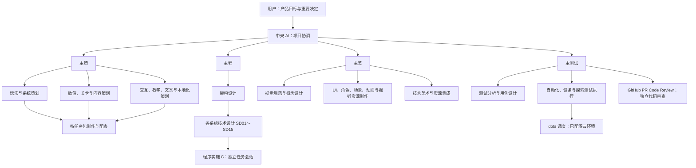

# FightMatch：AI 团队组织方案

2026-10-01 · r4 · **用户已确认本组织，并于10月1日将代码审查改交GitHub PR Code Review，自动化测试继续优先交dots。** 顶层为一个中央AI、主策、主程、主美、主测试；下层职责依本文与AGENTS第6节执行。当前角色及任务状态见[团队登记](../team/2026-09-30/README.md)，审查执行见[流程第7节](../../.agent/TEAM_WORKFLOW.md#7-github-pr-code-review)。下文旧交接与环境记录保留其历史时点。

## 1. 五个顶层角色

中央 AI 掌握项目架构地图、产品边界、进度和依赖，只负责分配、协调、追踪和收件。四位负责人分别承担专业方案与质量责任。中央保留理解全局所需的摘要，详细方案、实现和原始日志放在对应角色与仓库。

图中活跃团队角色使用独立会话，GitHub审查服务不再另建本地R会话；程序、美术、内容包交执行角色。下层按需启用，不同时空转所有岗位；简单任务不逐层重复写方案。

| 负责人 | 负责的决定与产物 | 接收依据 |
| --- | --- | --- |
| 中央 AI | 里程碑、优先级、任务负责人、跨线依赖、身份登记、进度和用户决策清单；接到正式结果后分发下一项可执行工作。 | 各负责人简短回执及证据索引；中央不代写详细设计、产品代码或独立审查结论。 |
| 主策 | 玩家体验、玩法规则、内容范围、数值目标、交互流程、教学和文字；组织策划设计与内容生产。 | 规则无矛盾、实例可解释、配表可校验、流程符合已定体验；玩法变更遵循用户决定。 |
| 主程 | 技术全貌、架构与系统设计分工、公共契约、开发依赖、接口集成、构建和发布技术方案；组织程序实施。 | 方案符合产品规则，修改范围明确，接口衔接与实现证据齐备；产品实现由 C 完成。 |
| 主美 | 美术风格、视觉标准、资源清单、制作规范、样片接收、资源适配；统筹图像、动画及音效等表现资源。 | 先确认代表性样片，再批量制作；交付源文件、导出物、规格和可用来源，最终在游戏内检查。 |
| 主测试 | 验收计划、风险场景、测试范围和预算、dots云测／设备安排、GitHub审查收件、缺陷分派与质量结论。 | 固定版本上的测试证据、对应PR/head的审查结果及专业接收；缺项如实保留。 |

主测试核对GitHub原始审查结果并跟踪修复，不替机器人编造批准，也不另做重复本地代码审查。ACCEPT／NEEDS_FIX／REJECT用于有依据的集成接收；旧R正式结论保留为历史。代码审查不代替策划／美术专业接收或实际测试。

## 2. 各专业线怎样往下分

### 主策：规则和体验 → 内容设计 → 制作

- **玩法／系统策划**：说明玩家能做什么、条件、收益、失败和特殊情况。例如广告收益怎么保留。这里的“系统策划”负责游戏规则；程序侧“系统技术设计”负责接口、状态和实现方案。
- **数值策划**：维护成长、经济、掉落与难度目标及算例，把已定规则落成可校验的 Excel／CSV；主策接收数值影响，程序提供校验工具。
- **关卡／内容策划**：编排首章关卡、敌人、Boss、节奏和默认攻略；制作过程继承已批准内容，候选不自动加入首版。
- **交互／教学／文案策划**：定义页面顺序、玩家操作、提示时机、文案语义和本地化语境；制作英／简中文字表，交主美排版、主程绑定、主测试验收。
- **制作执行**：依据已审阅方案配表、制关、录入文本与攻略；改变规则先回到所属设计负责人。

### 主程：架构 → 系统技术设计 → 实施与集成

- **架构设计**：维护依赖方向、状态所有权、共享接口和跨系统流程；给 SD01～SD15 同一份公共定义。
- **系统技术设计**：为各系统给出接口、状态转换、异常与恢复、验收样例及小型实施包。跨系统变更先交架构汇总，不能各自改出不同公共定义。
- **程序实施 C**：按白名单完成具体包及必要测试，先完成源码／静态检查，交固定候选给主测试；不在实施过程中自行换框架、改玩法或扩大接口。
- **集成／工具／发布执行**：按独立包完成 uGUI 接线、资源导入工具、构建和发布技术工作。后台、存储、CDN及云端构建的技术配置归此线设计，主测试提出执行环境需求。

主程了解系统全貌，架构会话维护共同设计，系统会话保留各自细节。小包可引用已有架构直接分发；公共契约只有登记的一位写入者。

### 主美：风格 → 专项制作 → 游戏内适配

- **风格／概念设计**：建立参考、配色、比例、轮廓、像素或其他已定表现规范，先做代表性样片；沿用已有美术会话和原型的有效成果。
- **专项制作**：UI视觉／图标、角色／怪物、场景／道具、动画／特效分别按任务创建制作会话；音效／音乐需要时另设资源制作会话。
- **技术美术**：制定尺寸、锚点、透明边、帧序、命名、图集、导出及运行时资源预算，检查批次一致性。
- **资源集成**：主美验视觉和资源规格，主程安排限定 Unity 导入／引用／uGUI 接线，主测试检查设备显示和加载。纯导出可由制作角色做，涉及代码、导入设置或 .meta 的工作必须进明确任务包。

### 主测试：验收目标 → 用例与环境 → 执行、分析、独立审查

- **测试设计**：把策划规则、系统契约和资源规格转成正常／失败／中断／恢复场景，优先核对已有证据并消除重复验证。
- **自动化测试**：执行必要静态、规则、集成与构建检查；测试代码的新增也有明确文件范围和独立检查，不能靠改弱断言使候选通过。
- **设备／玩法／视觉测试**：覆盖真实触控、暂停重开、下载、广告、分辨率、字体、性能和关卡体验；能在云端设备执行的另核实际环境。
- **GitHub PR Code Review**：独立审查固定PR/head的代码；QA接回发现、主程分派修复，不新派本地R重复审查。主策／主美仍负责内容与视觉接收，QA验证游戏内效果。
- **缺陷分派**：产品代码问题回主程、规则／数值问题回主策、资源问题回主美、环境问题协调主程的工具／环境执行者。每项缺陷给可复现步骤、影响版本和证据。

## 3. 跨线责任与执行约束

| 情况 | 唯一主责与协作方式 |
| --- | --- |
| 新增一个玩家功能 | 中央指定一个交付负责人。主策给体验与规则，主程给接口和实现，主美给表现，主测试给验收；统一任务编号连接各子包。 |
| UI页面 | 主策负责“怎样操作、何时提示”，主美负责“怎样呈现”，主程负责 uGUI 实现和本地化绑定，主测试负责完整流程与设备效果。 |
| 测试失败 | 主测试先区分产品缺陷、设计缺口和环境故障；对应负责人签最小纠正包，不让所有角色各自修一次。 |
| 已选方案需要变更 | 提案说明原决定、理由、受影响包和验证变化。更改用户既定框架、产品范围、付费承诺等由中央向用户提交；已批准方案内的日常技术细节由专业负责人处理。 |
| 集成与交付 | 主程组织固定候选和版本集成；各专业负责人接收本线结果，主测试给测试证据及GitHub审查链接／head，中央接收里程碑。提交、推送和发布沿实际授权执行。 |

角色隔离靠独立会话，执行一致性靠以下约束：

1. **任务包是唯一执行依据。** 负责人、目标、输入版本、允许文件、相关决定、可观察验收条件、返回对象与测试范围齐全后才下发。
2. **执行前回读。** 接单会话先简短复述任务范围和约束；事实一致即在授权范围继续，不为每一包等待用户确认。发现冲突先交负责人解决。
3. **固定候选，按依赖等待。** 源码、配置和资源形成可识别的提交或不可变快照；测试期间可推进不依赖它、写入范围不冲突的其他任务。
4. **分开作者自检、专业接收和独立验收。** 文件存在或作者说完成只进入待验收；完成条件包括本包要求的专业接收、QA证据及对应head的GitHub审查结果。
5. **每处只有一位写入者。** 下层会话不能越过文件白名单；公共接口、版本入口和场景等共享文件明确排期或隔离。工作区隔离、Git和依赖变更按原权限执行。
6. **正式结果触发下一步。** 调度者用可用完成事件／等待工具接回指定回合；核清正式回执后释放依赖，继续下一可执行包。不恢复五分钟定时任务。
7. **摘要留在上层，细节留在所属文件。** 中央只接状态、风险、下一步和证据位置；新会话读取角色入口、当前包和有关决定，避免转发整段历史和测试日志。

这些规则的启动说明、任务／测试／回执模板和启用检查见 [多会话执行约定](../../.agent/TEAM_WORKFLOW.md)。多会话本身不能保证零偏差；回读、文件范围、实际证据和独立审查负责发现偏差。

## 4. 一个完整例子：首次下载资源

这只是流转示例，不派发实现，也不重选已定规则：

1. 中央给主程一个跨线交付目标：“首次下载可恢复，使用手机流量前询问”，请求主策、主美、主测试配合。
2. 主策整理首次进入、剩余下载量、取消／重试和 Wi-Fi 转手机流量时的操作及文本；使用已定 Q35 和英／简中方案。
3. 主程交架构／SD13明确 YooAsset、R2、缓存、暂停／恢复和生命周期边界，再拆实现包。不能仅凭库文档把续传标成已经完成。
4. 主美制作下载页、进度和异常状态资源；交给独立程序包完成 uGUI 与占位符本地化绑定。
5. 主测试设计断网、关闭重开、半包损坏、换网络、拒绝手机流量和两种语言的验收；给固定候选安排云端和设备执行，并接回GitHub PR审查结果。
6. 等待上述测试时，已满足输入和文件范围条件的其他关卡或资源制作可继续；依赖下载通过的首次安装验收仍等待。缺陷回所属负责人，全部必需条件通过后中央收件。

## 5. dots 与已有云端准备

官方说明 dots 可协调持续工作，分派背景代理或独立会话；编程工作可使用预先配置的 Codex 云环境。新会话只获得为该任务提供的必要上下文，不自动继承全部聊天。[任务与记忆](https://learn.chatgpt.com/docs/dots/tasks-and-memory)

**实际在云端执行，才能把执行负载移出 Mac。** dots 也能调用连接的本机；由它协调本机 Unity 仍占本机。云端任务可在本机离线时继续，但测试所需代码、工具和依赖仍须就绪。[电脑与云任务](https://learn.chatgpt.com/docs/dots/computers-and-apps)、[云环境](https://learn.chatgpt.com/docs/environments/cloud-environments)

本轮只读查看已有“设置 FightMatch”会话：thread `01a0f13c-3d87-753a-ad11-16302add9084`、host `durable`，完成回合 `01a0f1c9-2a1d-706e-b035-37f93af183c5`。其回执报告 Unity2022.3.18f1 已安装／激活、FightMatch 编译成功，源码为 `9d416e6`。完整 EditMode 测试按用户要求停止，没有通过／失败结果；启动说明保存为草稿，默认不得自动测试／构建。当前未独立核原始云文件，也没有环境已发布的证据。

后续复用已有准备，先核环境是否已发布、精确源码／资源、入口和结果回传。旧云源码不包含当前未推送 WIP 和测试优化；本组织讨论不恢复旧全量测试。Unity EditMode／PlayMode、Android构建分别验证环境；纯代码云测不能代替 iQOO Neo5 等目标设备上的实际操作、显示、广告、下载和性能证据。

主测试负责“测什么、结论是否可靠”，dots承担获准云任务的调度，云端执行者返回原始证据。自动返回链路在正式启用时用小型交接任务核实；不能仅凭角色名称承诺当前会话已经能直接操纵 dots。云端仍使用时间和额度，不等于无限免费测试。[dots说明](https://learn.chatgpt.com/docs/dots)

## 6. 与现有角色的衔接

目标映射如下，当前尚未切换：

| 既有角色／成果 | 目标位置 |
| --- | --- |
| 当前 SD00 | 建议作为主程的起点，承接技术全貌和系统设计调度；详细架构交独立架构会话，SD01～SD15各保留系统设计会话。 |
| 原 C | 作为程序实施与集成执行者接续，保留已完成代码、WIP、证据及已定模型。 |
| 原 R | 保留历史结论；10月1日起不再接代码审查新包，代码审查转GitHub PR Code Review，QA统一收件。 |
| 策划资料与历史内容成果 | 由主策继承已批准规则、配表与内容证据，候选和未验收项分别标明。 |
| “FightMatch 美术与资源创作”等已有会话 | 接入主美线，保留已确认作品、工具准备及用户在这些会话的授权，不重复生产。 |
| 已有云端准备、测试优化成果 | 由主测试接收证据与执行要求，主程安排必要环境适配，不因换组织重跑长测试。 |

中央、主策、主程、主美、主测试分别独立会话；复用时明确职责与交接时点。旧合同中的代码审查执行方已由10月1日新规覆盖；C的串行本机Unity责任仍保持。

后续获准任务按以下顺序落实：登记五个负责人和已有角色的接续关系 → 给各会话完整启动说明及本次用户确认的授权出处 → 用小型文档任务验证派发／回传 → 接收主测试的云环境准备核对 → 按任务需要启用下层角色。用户已批准此协作方式，不为每包重复询问是否允许团队内分发与回执。当前尚未创建／迁移角色或验证完整通信链路；产品恢复、Git及费用边界另按实际授权。
