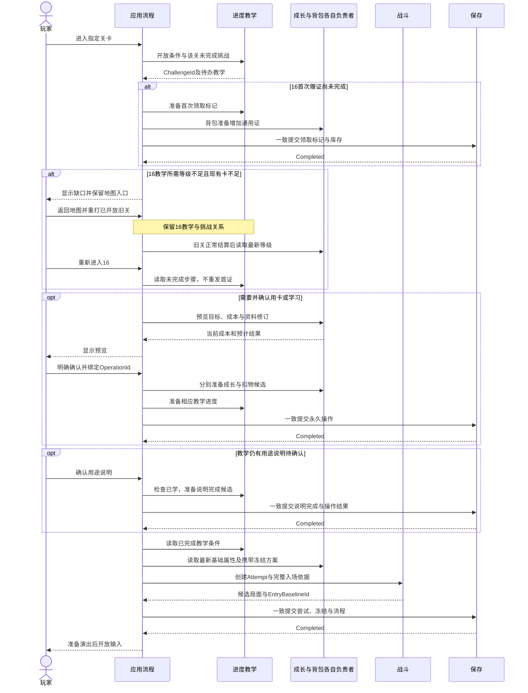
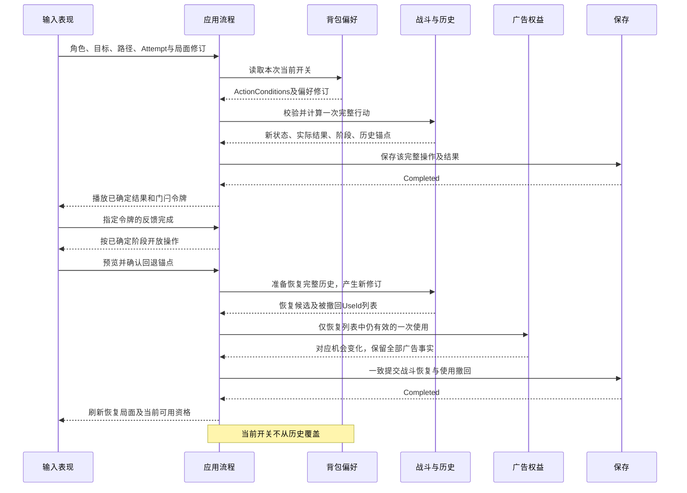
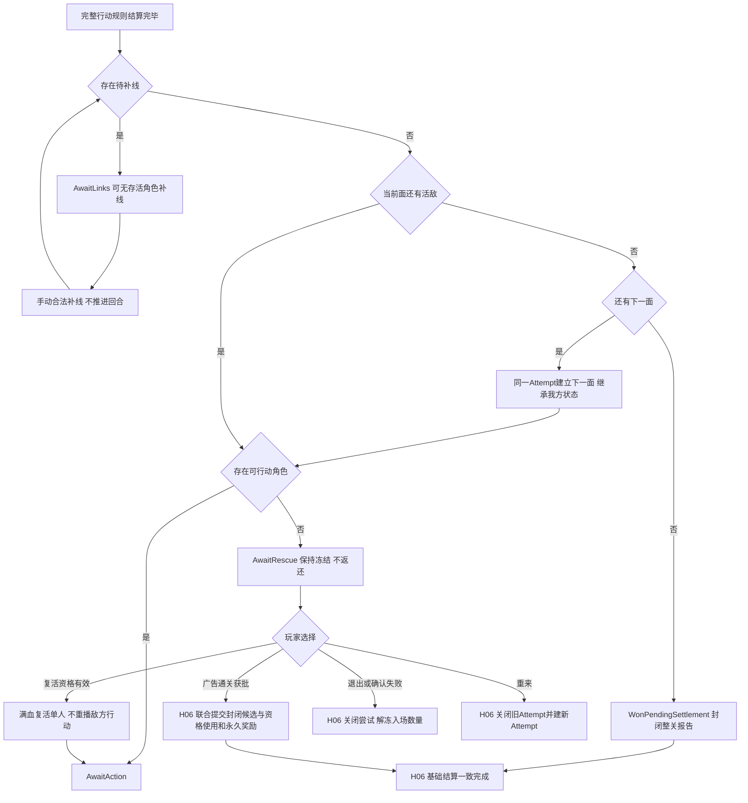
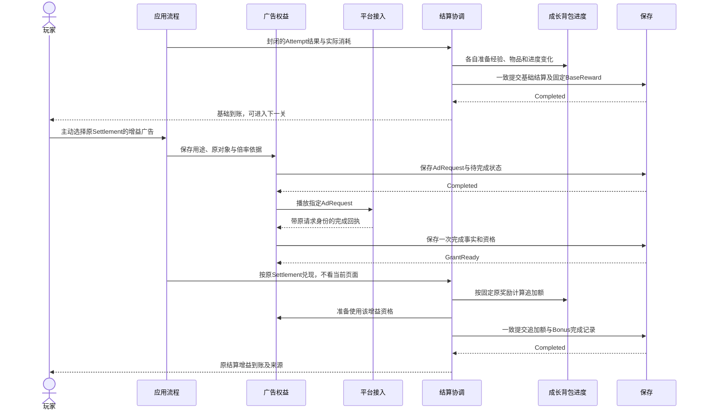
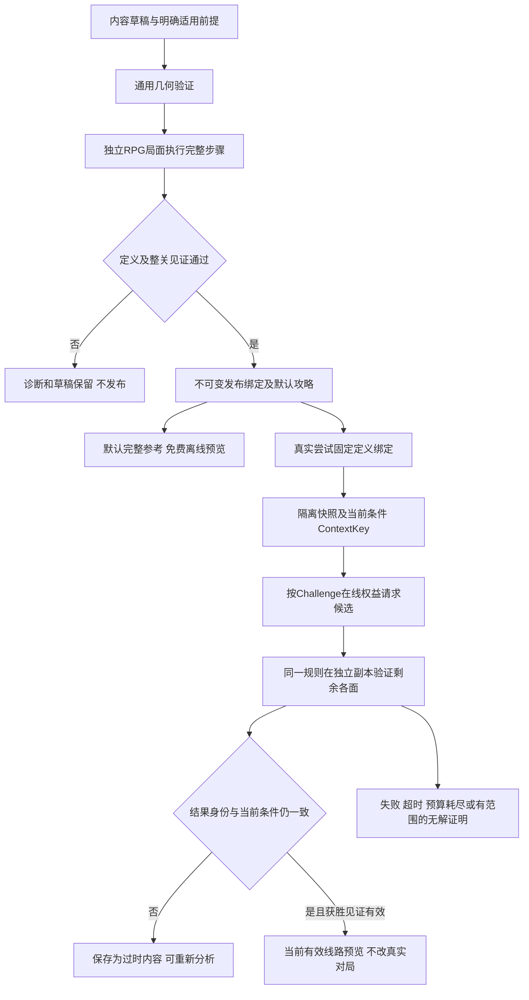

# FightMatch 统一系统设计：跨系统流程与场景推演

2026-09-17 · r5 · **文档推演，未执行游戏测试。** 保留原5组业务流程及A01～A12，Mermaid源未改；补充版本启用、偏好提交及联网撤回的文字条件。图中Interface和完成条件以[共同契约r6](interaction-contracts.md)和扩展r2为准；职责编号见[目录](system-catalog.md)。箭头表示请求／结果交接，不代表新建程序集或分布式服务。

更新、绑定、选档及一次广告联网使用的阶段表和X01～X13另见[H11～H14共同扩展](runtime-extension-contracts.md)。原图只展示业务交接，省略的联网许可不能解释为允许离线新兑现；原本机提交箭头也不代表云端与本机天然原子。当前不需要重画其余业务图来改变这一范围说明。

统一约定：所有图中的“提交一致版本”均包含相关负责者的候选变化、OperationId 结果和流程阶段；只有 H10 确认持久完成后才对外发布。保存失败保留旧版本，结果未知先查 CommitId。表现不成为业务完成的判据。

## F01 入场、永久操作与 G01 返回路径

图中“成长与背包各自负责者”只压缩画面：成长算属性／升级／学习，背包扣卡／证／材料，两者不互写。赠证、用卡、学习、说明各是独立确认边界，不把整个教学做成一个迟迟未完成的大操作。用卡／学习确认前返回不扣物，确认后返回保留永久变化；入场失败只丢弃未提交的战斗候选。

推演 G01：已领首证、战士差8经验且卡0 → 返回地图 → 仅战士回刷1得14经验 → W5＋6 → 重进16沿用首证 → 确认学习及说明 → 开战。16 的挑战不会被关1覆盖；关1不能重发首通奖励。首次进入16教学完成与首次通关16分属不同业务键。该14经验是已接收策划算例，本稿未复算战斗或验证正式棋盘。

## F02 完整行动、表现门闩与回退

攻击的规则转移按 H04 完成，动画只是消费结果。无效路线／角色或过时修订在计算前拒绝，不扣物、不抽随机、不记历史。动画中断从已提交最终视图重建，不重算 DOT 或敌人行动。旧动画令牌不能解除重来后的输入门闩。

回退例：rev7中消费角色W的grant g1／use u1，后来又完成广告g2；撤销跨过u1时，战斗恢复到锚点内容但发布rev12，g1在本机已撤回并保留机会／联网核对待办，g2和两份事实均保留。按H14确认原使用已撤回后，才可联网申请u2；旧回退不能释放u2。F02“刷新可用资格”须显示这一区别。若玩家已把毒箭关闭，恢复的是数量，下一行动仍读已提交关闭偏好；偏好写入未知时不能读候选值。旧rev7的攻略或点击请求均过时。

## F03 回合后阶段：补线、两面、救援与结束

图仅展开正常阶段推进和救援出口；帮助、回退、始终可提出的退出及适用广告通关仍按 H04 操作范围处理。AwaitLinks 中当前面尚有活敌时可对倒下角色使用适用复活，仍须补完线路；本面已清空则先补线，再翻面判救援或最终胜利。等待／翻面／补线不推进 CD、DOT、PRD、敌方意图或恢复次数。

两个必须区分的路径：第一面双方全倒 → 先补线 → 翻面 → 第二面救援，不能把第一面当胜利；最终面双方全倒 → 补完最后线路 → 正常胜利，不能强制看复活广告或免费复活队员。后一条在H06才把倒下者交给局外恢复。R02解释为原入场基线重来，永久成长和真实恢复时间不回退，主策划归档待完成。R01按新原则：重来舍弃旧战斗历史，撤回其中有效局内复活UseId并恢复对应机会一次；不能把HP初始化另算一次广告使用。

## F04 广告回执、基础奖励与增益

**r5对原图的必要补充：** 下图“准备使用该增益资格”到“本机一致提交追加额”之间，必须先按H14取得准确Grant／Use与固定向量共同持久的ResultCommitted。它不是仅取得许可或收到网络响应；未承诺前不得首次本机发放。承诺后本机失败续装同一RewardResultId，不退回GrantReady另发；只有本机H10完成才显示到账。原图保留为本机交接素材，不能省去这一远端完成门槛。

广告直接通关经H07取得原关卡的一次资格，保留发起AttemptId；玩家可在同关合法尝试B手动使用，H06一次提交其使用、B的封闭候选和永久结算，不先持久“资格已用但未结算”。上图展示之后另一项自愿广告，不自动连播。原经验14、倍率2.2只追加16，材料2只追加3；首通证和职业解锁不倍增，后来升级不重算旧BaseReward。

晚到复活机会归原CharacterId，不自动用；增益仍作用原SettlementId。未用广告通关机会归原LevelId，原尝试关闭或已正常通关也保留，可在同关后续合法尝试及新ChallengeId手动用一次；不自动结束当前战斗、不重复原奖励。重复回执先防重；保存成功但UI无回执时查询原OperationId，不重复发资格。

## F05 发布内容、默认参考与当前分析

真实尝试、默认见证和在线验证是三个局面实例；只共用规则与发布依据。默认攻略显示自己的初始前提；在线候选包含全部剩余 Boss 面及操作条件。模拟复活若用到既有机会，使用的是复制的许可和一次使用记录，不扣真实资格。搜索预算耗尽、候选无效和已证明无解是不同结果；广告已完成后分析失败仍可免费重试。

任何玩家行动、撤销、重来、相关道具偏好或权益变更都触发适用性重查。相同 HP／路线不能替代完整 ContextKey。只有旧候选在新副本上重新验证通过，才能作为新上下文的有效结果。开始实际画线时收起小窗和棋盘两处预览，上方战场始终保持真实状态。

## A01～A12 文档推演记录

下表按职责、提交点和中断路径作**文档推演**，不是运行通过。R01／R03沿用用户最新“不回收”原则；R02主策划归档及各系统实现验证尚未完成。

| 场景 | 推演输入与最终裁定 | 完成／拒绝／中断后保留 | 契约与流程 |
| --- | --- | --- | --- |
| A01 攻击、技能、DOT与动画 | 同一次行动含普攻、护盾与全场 DOT；M06 先求完整结果，DOT 同一时点形成死亡结果，表现依序播放。 | 一个行动仅一次真实扣血／贡献；重复点击查原结果，动画断掉仍恢复提交后的状态，不重放规则。 | H04／H10，F02 |
| A02 两面与全倒补线 | 第一面全倒有补线与最终面全倒有补线分别走 F03。M06 裁定面和阶段，M02 开放对应操作。 | 第一面不结算；最终补完后只结算整关一次，倒下者不免费恢复；存储断在救援仍是同一尝试。 | H04／H06／H10，F03 |
| A03 跨技能、道具与复活回退 | 有效使用 u1 后另获 g2，再回退跨 u1；M06 恢复完整历史，M08 只撤回 u1。 | 数量／CD／PRD恢复，g1机会恢复一次、g2及完成事实保留、永久学习不动；保存未知不先公布一半。立即重来已用机会另见 R01。 | H05／H07／H10，F02 |
| A04 等救援、继续、退出及重开 | 携带5、已用2，全灭等待；M06保留U3、背包仍冻结C5。复活继续不返还物品；退出解除冻结；胜利扣2。 | 胜利总量少2，放弃总量不变；重来新AttemptId、原C移交并撤回旧尝试有效局内复活使用，不双算。正常退出保留未用机会，已正常使用不无条件增发。R02固定原参战者及入场HP，不覆盖永久资料，主策划归档待完成。 | H02／H06，F01／F03 |
| A05 正常／广告通关与增益 | M06 给正常或广告结果，M07 分别选经验模式，固定 BaseReward 后由 H08 只发增量。 | 同 AttemptId 基础一次、同 SettlementId 增益一次；广告跳过无虚构消耗；首通证不倍增；结算中断能查原结果。 | H06／H08／H10，F04 |
| A06 广告回执晚于退出／换场 | 回执携原AdRequestId与对象；M08先记事实，再由对应业务核验。 | 复活机会保留但不自动用，增益只给原结算；未用通关机会按原关保留，原挑战通关不失效，同关后续合法尝试手动使用。重复事实不新发，不再发原正常胜利奖励。 | H07／H08／H10，F04 |
| A07 在线分析期间操作／回退／重来 | 抓取 rev8 后玩家回退产生 rev10，或改变毒箭偏好；旧回执 ContextKey 不等于当前。 | 旧内容只能以过时身份保存；重试不再收费；预算／失败不称无解；新验证独立于真实对局。 | H09／H05，F05 |
| A08 配置变化与跨环境验证 | 活跃尝试绑定V1，运行集合R1只支持V1，V2已发布／下载；M14未启用兼容集合前，M10新入场也不能交V2。 | 原尝试继续V1；下载不等于启用；服务不支持V1拒绝并保留权益，缺V1停止受影响恢复。内容发布完成不是玩家档Completed。 | H01／H09／H10／H11，第13节，F05 |
| A09 16教学不足并回刷 | 按G01指定见证用光卡、战士差8；M05 保留首证／步骤和返回地图，M07 结算旧关后 M03 更新等级。 | 再入读 W5＋6，确认学习一次；不重赠、不免等级、不锁旧关、不强制广告。界面和存档尚未实际验证。 | H02／H03／H06／H10，F01 |
| A10 永久操作中断与重复 | 用证学习、用卡和合成分别在候选前、写入中、写入成功但未显示时中断。 | 旧完整版本或新完整版本；查询同 ID 区分已完成，不能半扣物、双扣物或只记领取标记。新 ID 也不能绕过一次赠证／已学条件。 | H03／H07／H10，F01／F04 |
| A11 工具／攻略／游戏同一规则 | 几何可解但队伍伤害／生存不足，或见证只结束第一面；几何与RPG验证分别返回结论。 | 不能以几何通过发布为RPG必胜；模拟不动库存、奖励或权益；默认攻略须带完整前提；通用FlowPuzzle继续独立。 | H01／H09，F05 |
| A12 属性、开关与再次行动 | M03已算基础属性交入；M04经H04把偏好明确设置为关、H10完成后再回退。M06恢复战斗内容，下一行动读关。 | 不重复算成长；设置重复不翻转，未知不读候选偏好；偏好不改回合／SceneRevision。重演用旧条件、新行动用当前值；攻略核对新PreferenceRevision。 | H02／H04／H05／H09／H10，F01／F02／F05 |

## 推演中明确保留的验证边界

本文件覆盖原业务H01～H10与A01～A12；现行总索引为目录16职责／21状态、H01～H14。新增X场景与AR来源场景在扩展和[本轮逐项核对](../2026-09-17/integration-review.md)列责任及未决，不以数量覆盖冒充已解。G01保留A～D，特别是正常路线不强制回刷、不能外推所有资源状态可恢复。完整存档、回执补录、确定性、正式几何、搜索及手机表现仍需后续证据。

R01／R03的旧问题已由用户统一原则替代，R02主策划归档及详细系统验证尚未完成，不能称所有系统均可实施。Mermaid源本轮未改，未作浏览器或额外渲染检查；以上为文字条件推演，不标作视觉验证通过。
