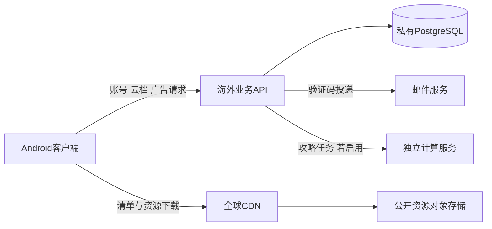

# 账号、云存档与广告后台：自建工程量及费用调查

**最新资源分发决定（2026-09-30，Q21）：用户已明确“好的，先按R2走”。** 首版公开资源采用R2 Standard＋Cloudflare缓存／CDN，客户端经YooAsset下载；优先较低实际服务支出。广告后端服务器仍独立待选。下文的暂缓／推荐表述保留各阶段研究背景，不覆盖本次正式选型；尚未开通或部署，主Goal继续暂停。

2026-09-30 · SD00汇总研究 · 对应任务包§465／Q20。本文不选择供应商、不授权实施、采购或部署；代码事实来自当前工作区只读检查，官方资料按本日检索。工时为工程判断，未实测、未报价。三名只读研究代理分别核工程量、服务器、CDN／邮件，SD00实读并合并同一份报告。

## 1. 结论与估算范围

**后续范围变更：** 用户以Google Play上线为先，将正式账号／云档／人工申诉后置，随后Q25明确首版保留广告变现并接受最小广告后端，Q26保留小启动包及首次下载主要内容／CDN。因此真实回执核验、匿名来源、奖励／资格／使用持久记录及重复／中断恢复仍需纳入首版；完整账号后端不再是首版前置。Go＋sqlc＋MySQL社区版已选，部署及CDN厂商未定，Q27已将在线攻略后置；Q28只保本机身份凭据，全部丢失不提供首版找回并提前告知。须按限定广告范围重估，不能套用55～95人日总数或单抽广告一行即承诺完整接入。Q23不合并两个正式账号；Q22换绑／解绑与Q24人工申诉虽已获方向批准，原估算未计入其完整新增范围，后续账号版本须另重估。本轮未部署或派发代码。

目前有可复用的本地存档、提交查询、来源账本模型及配置发布器，但没有接通账号、云档、广告服务端核验或发信。自建并非从游戏规则零起步，也不能把已有本地保存当成远端服务已经完成。现阶段不能按代码行数给出“后台已完成百分之几”。证据见第2节。

Supabase、Firebase与自建都需要实现本项目的选档、原广告奖励恢复、去重、来源控制、远端提交与本机安装等游戏业务。自建额外承担认证集成与安全、邮件验证码、部署和持续运维；采用托管数据库可以减少数据库运维，不能免去业务正确性和恢复验证。

**阶段判断：自建可行，难度中高，开发与运维投入须单列。** 最小接入验证约5～10人日；按本项目完整账号／云档／广告语义走到小规模上线验收，暂估约55～95人日，其中自建特有认证与运维责任约17～29人日。第7节的14～29美元/月是两家海外厂商特定规格含备份的常规报价，不是最低起步价；用户指出腾讯云价格后，现已核实海外轻量2核2GB30元/月、2核4GB42元/月，详见第11节。第8节R2的3.75美元也仅是用量算例，低用量可在免费额度内。用户进一步询问Go＋sqlc，能力核对见第10节；后续Q20A已明确选择Go＋sqlc，Q33复核后已改定MySQL社区版；云厂商仍未选定。

估算假设：一名熟悉所选服务端技术、关系数据库和Unity接入的工程师全职工作，已有产品决定按§465落实，先做单海外区域、小规模发布，使用成熟认证／密码组件与第三方邮件投递服务。不会自行设计密码加密；不会要求服务器实时裁决每一步离线战斗。上线容量须测量，不能由此表承诺某个DAU。**只估账号、云档、广告账本与相应客户端接入；不含uGUI迁移、Luban／本地化、HybridCLR／YooAsset客户端整体接入、在线攻略算法／模型服务、全部游戏内容、商店审批、全天候值班或跨区域高可用。** 尚未决定的正式账号合并、人工申诉和完整换绑范围也未计入；Play所要求的账号删除入口与关联数据处理计入账号工作。[Play账号删除要求](https://support.google.com/googleplay/android-developer/answer/13327111?hl=en)

## 2. 当前实现：真实本地能力与远端缺口

下列路径均相对仓库根；行号对应本次读取的工作区，不代表已提交版本。

| 能力 | 当前代码事实与边界 | 直接证据 |
| --- | --- | --- |
| 游客资料 | 新档创建本地GUID作为PlayerId；打开已有档仍从本地locator和存储工厂取得资料。这不是服务器认证的匿名账号，也不能单凭PlayerId读取云档。 | [CandidateLifecyclePreparation.cs:16–31](../../../Assets/Scripts/FightMatch/Application/CandidateLifecyclePreparation.cs#L16)、[FightMatchHostSession.cs:150–195](../../../Assets/Scripts/FightMatch/Host/FightMatchHostSession.cs#L150)；身份边界见[guest-account.md:21–32](../2026-09-16/details/guest-account.md#L21)。 |
| 本地存档 | 已有真实本地文件适配；Host使用persistentDataPath，Android接AndroidLocalSaveStorage，Mac接MacEditorSaveStorage。LocalSaveStore核本地预期头、生成提交、拒绝重复操作并按原操作查询结果。可复用本机事务边界，但不是数据库事务／跨设备排他。 | [FightMatchPlayerHost.cs:61–74](../../../Assets/Scripts/FightMatch/Host/FightMatchPlayerHost.cs#L61)、[LocalSaveStore.cs:57–123](../../../Assets/Scripts/FightMatch/Platform/LocalSaveStore.cs#L57)。 |
| 账号接入 | 当前产品源码检索未找到Firebase、Supabase、Unity Services认证、Google登录、SMTP或账号网络客户端。包清单也未列上述SDK。设计文档明确这里只定义接入能力，不声称认证已实现。 | [Packages/manifest.json](../../../Packages/manifest.json)、[guest-account.md:55–62](../2026-09-16/details/guest-account.md#L55)。源码检索范围为Assets/Scripts/FightMatch；结论不覆盖仓库外服务。 |
| 云存档 | 有选档与证据协议文档，没有已接通的云存档服务。当前必需恢复切片登记只列M02～M07及roster/permanent；不能把这些登记说成M15身份／M16云同步运行实现。设计明确要求服务器同时核CloudRevision=R、证据修订=E，但不声称后端事务存在。 | [PlayerRosterSession.cs:11–19](../../../Assets/Scripts/FightMatch/Application/PlayerRosterSession.cs#L11)、[cloud-sync.md:135–138](../2026-09-16/details/cloud-sync.md#L135)。 |
| 广告来源 | 已有原Grant、Fact、Use和检查点引用，以及持有／消耗／转换的领域结构；源校验检查字段、关联与范围。代码明确现有证据引用只是数据，不是发奖或可信标志；未找到真实广告SDK／服务端验签与持久发奖实现。 | [CandidatePermanentModels.cs:28–82](../../../Assets/Scripts/FightMatch/Core/CandidatePermanentModels.cs#L28)、[CandidatePermanentInventory.cs:70–90](../../../Assets/Scripts/FightMatch/Core/CandidatePermanentInventory.cs#L70)；[ad-entitlements.md:40–48](../2026-09-16/details/ad-entitlements.md#L40)要求真实事实和主体可核验。 |
| 测试替身 | EditMode中的MemorySave是Dictionary与MemoryStream实现，用于本地故障注入；它不是远端数据库、跨进程耐久或真实认证测试。不能反向推断产品本地存档也是内存实现。 | [PlayerSessionTestData.cs:221–241](../../../Assets/Tests/EditMode/FightMatch/PlayerSessionTestData.cs#L221)。 |
| 配置与分发 | 已有绑定校验及发布记录；当前Host从Application.streamingAssetsPath加载六个首发文件。UnityWebRequest出现在该加载器，不等于已经部署海外API／CDN或实现热更新。 | [PublishedContentCompiler.cs:14–35](../../../Assets/Scripts/FightMatch/Content/PublishedContentCompiler.cs#L14)、[PublishedContentCatalog.cs:18–47](../../../Assets/Scripts/FightMatch/Content/PublishedContentCatalog.cs#L18)、[FightMatchPlayerHost.cs:39–40](../../../Assets/Scripts/FightMatch/Host/FightMatchPlayerHost.cs#L39)、[FightMatchStreamingAssetsLoader.cs:13–36](../../../Assets/Scripts/FightMatch/Host/FightMatchStreamingAssetsLoader.cs#L13)。 |

本次检索未发现仓库内服务端项目、数据库迁移或服务部署文件；这是一项当前工作区盘点，不是对外部环境的审计。源码中的来源哈希只能检查一致性，不能证明广告真实完成或离线记录可信，旧设计也明确把后端准入列为未完成协议：[cloud-sync.md:34–37](../2026-09-16/details/cloud-sync.md#L34)。

## 3. 估算必须遵守的已定业务

以下直接采用[任务包§465](system-task-packets.md#465-grillme逐项设计访谈与广告合成决定)的最新回答，不能用供应商自动合档替换：

- 同一广告两档都收到后分叉，只保留所选档对同来源的结果（Q1）。所选B从未收到A独有的广告材料／经验卡，补原始奖励，不导入A合成产物／转换经验（Q2、Q5）；反复选档不能重复补。
- 同种材料／战斗道具先消费广告来源（Q9）。当前源码只有UseExperienceCards分支显式按广告优先排序，其他永久消费仍有明确选份额约束；新规则需要实施对齐：[CandidatePermanentInventory.cs:119–125](../../../Assets/Scripts/FightMatch/Core/CandidatePermanentInventory.cs#L119)。
- 首通16证唯一（Q14）：所选B已消费则保B学习结果和0张余额，不再补A证；其他独有广告奖励行按各自来源处理。部分消耗与完整接入组合已闭合，不重问用户（§465“依据已答规则可直接推出的组合”）。
- 每职业一个角色；A战士直接广告50经验上传后，B同账号对应战士接入50经验，按职业对应、同来源去重，缺职业等正常解锁（Q18）。不能把直接经验改成可自由分配卡。
- 海外Google Play、游客先玩、自愿绑定、Google与邮箱两入口；同一邮箱账号同时支持密码和数字验证码，玩家选择，平日同设备记住会话（Q4、Q6、Q8）。邮件链接不能替代数字验证码，两种邮箱登录不能形成两份进度。

旧文档里独有卡转换经验的见证须同步到新决定。这是设计整理与实现工作，不是新的玩家选择。

## 4. 技术候选与承担的责任

| 方案 | 可以交给现成服务的部分 | 团队仍须负责的部分 |
| --- | --- | --- |
| 托管BaaS＋项目游戏业务 | 所选产品原生支持的认证、数据库运行和部分部署能力；能力要按Google／密码／数字OTP分别核实。 | 下节全部共同业务、客户端接入、服务权限、实际备份能力与恢复验收。供应商不提供该项目的选档政策；某家缺原生数字OTP时还需补认证链路。 |
| 自有API＋托管数据库＋邮件服务 | 数据库服务器维护与约定范围内备份、邮件投递。 | API／账号集成／业务权限、来源账本、事务条件、密钥、监控、数据库模式和恢复演练。数据库日备份不能被说成任意时间零数据丢失。 |
| 自有API＋自管数据库 | 基础云主机、外部邮件投递和可选对象存储／CDN。 | 上述工作加操作系统／数据库补丁、容量、数据库一致备份、恢复与故障值守。单VM运行API和数据库可以降低起步账单，但仍有单故障域。 |

**自建C#方向是可评审候选，不是已选技术栈。** ASP.NET Core Identity可提供用户／密码及访问令牌、刷新令牌等基础组件；其内置bearer令牌是专有格式，不是JWT，也不是完整身份提供方。内置login需要邮箱和密码，其twoFactorCode是二次认证，不能据此宣称已有“只填邮箱数字码登录”。Google接入、数字OTP入口、同用户首次设密码及关联政策仍须明确实现并验证。[Microsoft官方Identity API](https://learn.microsoft.com/en-us/aspnet/core/security/authentication/identity-api-authorization?view=aspnetcore-10.0)

Google服务端需要校验ID令牌签名、aud、iss与过期时间，使用稳定sub识别Google主体；不能信客户端自报邮箱，也不能仅因同名邮箱直接搬走已有游戏来源。Google建议使用库完成令牌验证；其第三方邮箱与Gmail／Workspace权威性也有区别。[Google官方后端认证](https://developers.google.com/identity/sign-in/android/backend-auth)

使用C#服务端可能复用领域逻辑，但不能承诺直接复制Unity程序集即能运行。Core声明noEngineReferences并依赖FlowPuzzle.Core；Application还依赖Platform、QFramework和Content，独立服务端构建与序列化一致性仍需验证：[Core.asmdef:4–15](../../../Assets/Scripts/FightMatch/Core/FightMatch.Core.asmdef#L4)、[Application.asmdef:4–19](../../../Assets/Scripts/FightMatch/Application/FightMatch.Application.asmdef#L4)。数据库、ORM和令牌方案在实施包前提出具体候选，不在本调查里默选。

## 5. 分阶段工程量：估算，不是交付承诺

**先做最小接入验证，约5～10人日。** 在后续明确授权的隔离环境验证：Android真机到API／数据库的一条登录和会话续期链路、同邮箱密码／OTP统一用户的技术路径、Google令牌验证、一个云档条件写入，以及广告提供商可提供的真实服务器回执。输出成功证据、失败边界及重估工时；不要求此阶段覆盖全部恢复案例，也不把演示接通称为上线完成。这个阶段的可复用工作计入后续各项，不再重复相加；第三方配置审核或邮件投递资质等待不计作纯人日。

**完整小规模上线的共同工作，估算40～63人日：**

| 工作包 | 产出／难点 | 估算人日 |
| --- | --- | --- |
| C0 规则与接口收束 | 将Q1／2／5／9／14／18落实为来源单位、结果状态、错误及验收例；同步旧冲突见证。 | 3～5 |
| C1 账号与来源业务 | AccountId／PlayerId／游客控制证明关系、原操作查询、访问权限、绑定到既有账号的冲突和重复处理、账号删除入口及关联数据处理；不含从零做认证基础。 | 5～8 |
| C2 云档与永久收益 | 检查点／来源覆盖、所选普通档、独有原物恢复、职业经验映射、首通唯一、R与E联合条件提交、操作结果持久查询、远端／本机分开恢复。 | 12～18 |
| C3 广告资格服务 | 真实回执核验、Fact／Grant／Use／恢复决定、重复与乱序、迟到回执、归属与排他；覆盖首版采用的广告用途，不另做广告平台。 | 8～12 |
| C4 Unity业务接入 | 登录／云档／广告适配、会话持久化、回调入队、本机联合安装、断网和未知结果恢复、已授权交互提示。 | 7～12 |
| C5 综合验收 | 两设备与独立游客、错误注入、回归、版本迁移、容量与失败恢复证据；不是只测正常登录上传。 | 5～8 |

**完全自建额外承担，估算17～29人日：**

| 工作包 | 新增责任 | 估算人日 |
| --- | --- | --- |
| S1 认证与邮件 | 接成熟账号组件；Google验证、邮箱密码与数字OTP归同用户、首次设密码／重置、令牌续期／失效、限速和防重复码；邮件模板、域名与投递接入。 | 8～14 |
| S2 部署与运维 | 海外API／数据库环境、TLS／秘密保管、发布回滚、指标告警、数据库备份与恢复脚本、基础内容分发部署。 | 6～10 |
| S3 自建专项验证 | OTP猜测／重放、跨账号访问、令牌失效、密钥轮换、数据库／主机故障恢复与操作手册演练。 | 3～5 |

合计57～92人日，沟通可取**约55～95人日、单人约11～19个全职工作周**量级。实际日历还受评审、SDK配置、返工和并行Unity开发影响；缺乏后端安全／运维经验会显著增加时间。估算不是Codex运行小时，也不能把多代理数量直接用于等比分摊；Unity仍按既定规则串行。最小验证结束后应根据真实广告回执、身份接入与来源协议复杂度重新估算。

BaaS能减少S1／S2的一部分，但不等于直接从总数扣掉17～29天：SDK兼容、权限配置、数字OTP缺口、邮件服务与恢复验证仍有工作。本次不为Supabase／Firebase虚构精确天数差，待各自最小链路验证后比较。

正式运营后的补丁、证书／发信配置、容量观察、账单和备份恢复抽查也需维护。规划时可先留每月0.5～2工程人日作为常规维护预算；这是未实测的工作量假设，事故处理和新增功能另计，托管方案也不能把业务维护降为零。

## 6. 能称为完成的验证门

1. **身份门。** 同一邮箱分别密码／数字OTP登录得到同一账号和资料；先OTP再设密码、已有密码再OTP均成功。Google主体证明可校验；无权访问他人来源。重启正常续会话，失效会话明确重新认证；过期或重复OTP不再授权。秘密不写入普通云检查点。绑定到已有账号后保持原PlayerId及广告请求归属，不复制出可重复消费来源。依据：[guest-account.md:21–49](../2026-09-16/details/guest-account.md#L21)。
2. **云档门。** 两设备实际跑通Q1／2／5／9／14／18及部分消耗组合。R或E变化使原提案失效；同OperationId同意图取原结果，不同意图拒绝。服务器已提交但回包丢失、下载后本机头变化、安装失败／未知均不重复给物品或覆盖新进度。依据：[cloud-sync.md:135–142](../2026-09-16/details/cloud-sync.md#L135)和§465最新回答。
3. **广告门。** 使用真实提供商可核验回执；有效事件只建一份原事实，伪造、重放、错主体不能领取；迟到／乱序结果归原请求。资格许可与本机效果、恢复决定与当前资格分开核验；不能把客户端哈希当服务端广告证明。依据：[ad-entitlements.md:40–48](../2026-09-16/details/ad-entitlements.md#L40)、[ad-entitlements.md:81–118](../2026-09-16/details/ad-entitlements.md#L81)。
4. **故障与恢复门。** 在数据库事务提交前后、远端成功与本机安装之间、进程退出和网络中断处注入故障，仍可查原结果。实际恢复备份并检查CloudRevision、操作去重索引、广告账本和存档对应一致；磁盘快照成功不能代替数据库一致性证明。先定允许数据损失／恢复时长，再验证所购备份满足；不能把日备份称作零RPO。
5. **部署门。** 对选定海外区域测实际目标网络的登录、邮件到达、云档和广告回执表现；量出流量、储存增速和延迟。演练发布／回滚、密钥轮换和告警处理。资源分发须维持既有发布绑定及旧局内容引用；API、云档和凭据不得当成公共静态资源缓存。

本轮只检查源码与文档、阅读官方网页并写本文；以上验证均**NOT RUN**。历史本地测试或文档推演不代替真实服务验收。

## 7. 海外服务器、邮件与月费

以下为2026-09-30公开美元未税价，不含域名、额外监控、开发／运维人工。2GB是开发／小试候选，4GB是较宽松的比较基线；都没有项目容量测试，不能用月活数量直接认定某档够用。

| 海外Linux主机，API与PostgreSQL同机 | 主机/月 | 供应商备份/月 | 合计/月 | 配套空间与出站额度 |
| --- | ---: | ---: | ---: | --- |
| DigitalOcean Basic Regular，1核／2GiB | $12 | 周备份$2.40 | **$14.40** | 50GiB SSD／2,000GiB |
| DigitalOcean Basic Regular，2核／4GiB | $24 | 周备份$4.80 | **$28.80** | 80GiB SSD／4,000GiB |
| Linode Shared，1核／2GB | $12 | $2.50 | **$14.50** | 50GB SSD／2TB |
| Linode Shared，2核／4GB | $24 | $5 | **$29.00** | 80GB SSD／4TB |

依据：[DO整机价](https://www.digitalocean.com/pricing/droplets)、[DO备份价](https://docs.digitalocean.com/products/backups/details/pricing/)、[Linode亚太Compute及Backups价表](https://www.akamai.com/cloud/pricing/asia-pacific)。DO周备份是机价20%，日备份30%，对应两档日备份合计15.60／31.20美元。Linode备份服务有日、周、隔周及手动槽位；两者默认含一个公网IPv4。[Linode备份](https://techdocs.akamai.com/cloud-computing/docs/backup-service)、[默认IPv4](https://techdocs.akamai.com/cloud-computing/docs/create-a-compute-instance)

两家都有新加坡、美国及欧洲区域；实际区域按首发主要玩家分布确定。当前只核公开销售规格，未进入控制台核库存。初期可比较一个主区域加全球资源CDN，不必先建全球多主数据库；CDN也不会自动消除登录／写存档到主区域的网络延迟。[DO区域](https://docs.digitalocean.com/platform/regional-availability/)、[Linode美洲](https://www.akamai.com/cloud/pricing/north-america)、[Linode欧洲](https://www.akamai.com/cloud/pricing/europe)

DO超额出站$0.01/GiB，Linode所列常规区域$0.005/GB；各自流量池、运行时长及特殊区域有规则。这些是服务器流量额度，不是全球CDN套餐。[DO流量](https://docs.digitalocean.com/platform/billing/bandwidth/)、[Linode流量](https://techdocs.akamai.com/cloud-computing/docs/network-transfer-usage-and-costs)

**上述主机＋备份只是基础账单。** 单机无自动故障切换；磁盘快照不能替代数据库一致备份和恢复证据，DO也明确其对数据库I/O的限制。上线前还需确定数据库日志／异机备份、监控和恢复安排，再重算费用；托管数据库的日备份同样不能被称为零数据丢失保证。[DO备份限制](https://docs.digitalocean.com/products/backups/details/limits/)

### 邮箱验证码

使用现成邮件投递服务即可。以SES为例，基础发送费$0.10/千封，邮件数据及选用附加功能另计；每月2千／2万／20万封，对应基础发送费约**$0.20／$2／$20**。这是按发送次数计算，正常保持登录不应每次打开游戏都发码。[SES价格](https://aws.amazon.com/ses/pricing/)

新SES账号默认沙箱只向已验证收件人发送，限200封/24小时及1封/秒；上线需申请生产访问并验证发件身份。发信服务不替我们生成、校验、过期或限制验证码。[SES准入](https://docs.aws.amazon.com/ses/latest/dg/request-production-access.html)

### 托管与自托管的比较边界

- **Supabase托管**：Free可先验证；Pro从$25/月起，含一个Micro计算实例的抵扣，邮件与可能的额外计算／用量仍另算。它负责一部分认证和数据库运行，项目业务仍要写。[价格](https://supabase.com/pricing)
- **Firebase托管**：没有同样的固定月订阅，线上Cloud Functions需Blaze；免费额度以上及其他计费服务按量。邮箱数字OTP需另实现，不能以免费的邮箱链接替代。[计费计划](https://firebase.google.com/docs/projects/billing/firebase-pricing-plans)
- **自托管Supabase整套服务**：官方全组件最低4GB／2核／40GB SSD，推荐8GB及4核；可裁减不用的服务，但要自己维护升级、配置与数据库。它不是用一台最小VM即可免费获得托管服务，起步主机费用也未必低于托管Pro。[官方自托管要求](https://supabase.com/docs/guides/self-hosting/docker)
- **自有C# API＋Cloud Run＋托管PostgreSQL**：API可按活跃计算时间计费，数据库另计。以Iowa参考，Cloud Run活动CPU $0.000024/vCPU秒、内存$0.0000025/GiB秒，请求$0.40/百万；每账单账户有对应免费额度。不能将并发请求逐个时长相加或默认CPU全天运行。[Cloud Run价格](https://cloud.google.com/run/pricing)

Cloud SQL中`db-g1-small`参考$0.035/小时，730小时约$25.55；仅1.7GiB且不在该服务SLA内，磁盘和备份另计。这说明API计算很便宜时，数据库仍可能构成基础月费；不是完整高可用后台报价。[Cloud SQL价格](https://cloud.google.com/sql/pricing?hl=en)

攻略计算独立预算。现有完整RPG搜索没有性能基准，不能默认和账号API共用一台小VM；Supabase托管Edge Functions每请求2秒CPU，也不能冒充较长墙钟时间内持续运行重搜索。[函数限制](https://supabase.com/docs/guides/functions/limits)

## 8. CDN与海外资源分发

自建游戏后台可以同时使用现成对象存储、CDN和邮件服务。拟比较的职责拆分如下，尚未部署：

账号凭据、私人存档及广告账本经鉴权访问，不能放入公开桶统一缓存。CDN只分发可公开资源；发布清单仍须按已定版本绑定、校验和回退规则处理。

### 两个公开资源候选

| 方案 | 当前官方费用 | 关键条件 |
| --- | --- | --- |
| **R2 Standard＋Cloudflare自定义域缓存** | 存储$0.015/GB月，写类$4.50/百万，读类$0.36/百万；月免费10GB存储、100万写、1000万读；出站免费。 | 生产用自有域名，`r2.dev`限速且供开发。缓存规则须配置，Free／Pro／Business单文件缓存上限512MB；域名、Workers等额外项目另计。 |
| **S3＋CloudFront固定套餐** | CloudFront Pro $15/月/分发，含50TB／1000万请求和50GB S3 Standard存储抵扣；Free套餐100GB／100万请求。 | S3请求不是全部免费；持续明显超套餐可能调整分发性能。AWS Free Tier账户不能使用这些固定套餐，需核账号类型。 |

依据：[R2计价](https://developers.cloudflare.com/r2/pricing/)、[公开桶与生产域名](https://developers.cloudflare.com/r2/buckets/public-buckets/)、[R2缓存限制](https://developers.cloudflare.com/cache/interaction-cloudflare-products/r2/)、[CloudFront套餐及账户要求](https://docs.aws.amazon.com/PricingPlanManager/latest/UserGuide/plans.html)、[套餐权益与超量处理](https://docs.aws.amazon.com/AmazonCloudFront/latest/DeveloperGuide/flat-rate-pricing-plan.html)。

CloudFront还有按量计费及其免费额度；不能和固定套餐混算。S3到CloudFront的传输免费，但对象存储及请求按地区、套餐抵扣另算。[CloudFront FAQ](https://aws.amazon.com/cloudfront/faqs/)、[S3价格](https://aws.amazon.com/s3/pricing/)

**R2不是所有费用都为零。** 例如明确假设账户保留20GB、每月2000万次到达R2的读操作、写入未超免费额，则存储$0.15＋读$3.60＝**$3.75/月**。CDN缓存命中不需要同样数量的R2回源；上述请求量不等于玩家访问次数，也不绑定某个MAU规模。

### 分清新增玩家与月活的下载量

`月公开资源下载量 = 新安装数N × 首次资源大小 + 各次更新的实际下载人数 × 对应更新大小`

以下**仅为算例**：首次资源100MB，每月两次各10MB，全部月活都下载更新；首月N=M，稳定月N=20%M。

| 月活M | 首月资源下载 | 稳定月资源下载 | 每月每人2封邮件时的SES基础发送费 |
| ---: | ---: | ---: | ---: |
| 1,000 | 120GB | 40GB | $0.20 |
| 10,000 | 1.2TB | 400GB | $2 |
| 100,000 | 12TB | 4TB | $20 |

使用近似十进制单位；未计重装、重试和其他章节下载，不是实际包体或并发容量测量。小启动层把一些首次可玩下载转到资源服务，未必减少首次总下载量；Play安装基座与自有CDN资源应分别计量。更新按缺失文件下载，不能用源码改动字节数估流量；旧版本和回退保留还占存储。[现有更新设计](../2026-09-16/details/update-lifecycle.md#L70)

### 一个可复算的基础组合

DO 4GB＋周备份$28.80，叠加上面的R2独立用量示例$3.75及2万封邮件$2，合计**$34.55/月**。域名、税费、额外数据库日志／备份、监控、攻略计算和人工另计；该算例不承诺支撑1万或10万玩家。若换CloudFront Pro，CDN部分先计$15，再核S3实际抵扣和请求费。

因此，可以用约30～50美元/月作为这一类小规模基础组合的初步现金预算情景，但不能把它当完整可靠上线报价或费用上限。部署前需用实际存档大小、同步频率、广告事件数、峰值、账本增长、日志留存及最终资源清单重算。

**更新后的SD00建议：** 游戏业务自己实现，认证／数据库是否托管和资源分发分别选择。用户补充Go学习目标及腾讯云价格后，自有Go API＋sqlc＋PostgreSQL、腾讯海外轻量已成为有价格优势的候选；可以优先验证30元/月规格能否满足小规模目标。省运行现金与省开发／运维工作是两项不同取舍，不能再仅据DO/Linode常规价断言自建起步费用接近Supabase。当前没有替用户确定路线。

## 9. 仍待验证的工程事实

- 选用认证／SDK在Unity2022.3目标补丁、Android IL2CPP、Google Play环境的实际可用性，以及Google和邮箱的账号关联证据路径。
- 真实广告提供商的服务端回执字段、去重键、迟到回执和历史查询能力是否足以支撑已定恢复协议；不足时先明确能力缺口，不默改玩家政策。
- 来源覆盖／离线记录的服务器准入、证据留存期限和数据库条件事务布局；这些是设计及验证欠账，不再让用户猜SDK术语或替工程师验证技术事实。
- 托管或自管数据库的备份恢复点、恢复耗时、部署区域与实测容量；本调查不承诺任意故障零损失。

## 10. Go＋sqlc补充评估

2026-09-30后续决定：用户在Q20A明确选择“后端用Go＋sqlc”。这次已将语言与数据库拆开提问，PostgreSQL当时仍为数据库候选，不因选择Go而自动获批；后续经Q33独立讨论先获选PG，追加求职比较后用户最终改定MySQL社区版。完整账号托管Q20B已后置，资源分发Q21仍按用户要求暂缓。

用户正在学习Go＋Godot教程，询问以后是否可用Go＋sqlc。**可以把Go＋sqlc＋PostgreSQL作为FightMatch后台候选**；Unity C#客户端通过HTTPS调用Go API，客户端引擎与后端语言独立。该提问不代表要求把现有Unity项目迁到Godot，也不代表已选择自管认证或数据库。[Go HTTP服务](https://pkg.go.dev/net/http)、[Go编译部署](https://go.dev/doc/tutorial/compile-install)

sqlc从SQL生成类型化Go数据库访问代码，支持pgx/v5及通过WithTx绑定数据库事务。因此本项目的“云档版本与权益版本都没变化才提交”、唯一广告来源和重复请求查询，可在PostgreSQL事务中设计实现。sqlc本身不生成这些业务规则、迁移策略、认证或权限检查。[sqlc工作方式](https://docs.sqlc.dev/en/latest/index.html)、[事务](https://docs.sqlc.dev/en/latest/howto/transactions.html)、[pgx支持](https://docs.sqlc.dev/en/latest/guides/using-go-and-pgx.html)

建议评估的分工是：Go处理身份关联、接口、云档提交、广告事实与账本；Unity继续承载已定玩家流程与本机游戏运行。界面、配置发布和战斗执行无需为了后端语言而整体改写。远端仍须核真实广告回执和来源准入，不能仅凭客户端上传“看过广告”就授予权益。

若以后服务端需要精确战斗验证或攻略搜索，优先评估复用现有C#规则组件；不顺手在Go中重写第二套算法。当前精确分数／大整数、PRD与PCG状态及回放规则对结果一致性有明确要求，不能改为普通浮点或Go默认随机。确需跨语言实现时须新增一致性合同及样例验证，当前估算未计整套战斗规则移植。[数值编码](../../../Assets/Scripts/FightMatch/Core/ExactSaveValueCodec.cs#L9)、[随机采样](../../../Assets/Scripts/FightMatch/Core/ExactRandomSampler.cs#L9)、[回放比较](../../../Assets/Scripts/FightMatch/Core/CandidateReplayComparison.cs#L18)

**语言与托管方式应分开决定。** Go＋sqlc既可连接自管PostgreSQL，也可连接Supabase等托管PostgreSQL；账号认证还可使用现成服务。服务端选择合适的直连／连接池模式，数据库凭据不发给Unity客户端。Supabase连接池模式对预处理语句等有区别，后续接入须实际验证。[Supabase数据库连接](https://supabase.com/docs/guides/database/connecting-to-postgres)

前面工时按熟练工程师估算；正在学习Go不能作为缩短估算的依据。Go与C#的选择也不会自动减少CDN流量、免掉验证码投递费或解决数据库运维。当前只确认可行性，未创建Go项目、生成SQL代码或安装工具。

## 11. 腾讯云低价路线补核

用户说明另一微信小游戏使用腾讯云CDN，服务器印象为一年或两年70多元。这个历史成交价不能用海外其他厂商的常规报价否定；其具体地域、规格和优惠资格尚待可选补充。以下是2026-09-30从腾讯官方现价和活动核到的公开例子，金额为人民币：

| 例子 | 规格 | 官方价格 | 条件 |
| --- | --- | ---: | --- |
| 新加坡、硅谷、弗吉尼亚、法兰克福等Linux入门型 | 2核2GB、40GB SSD、20Mbps峰值、512GB/月 | **30元/月** | 普通公开价；简单累计360元/年 |
| 上述海外地区Linux入门型 | 2核4GB、60GB SSD、30Mbps峰值、1536GB/月 | **42元/月** | 普通公开价；简单累计504元/年 |
| 香港Linux入门型 | 2核2GB、40GB SSD、20Mbps峰值、512GB/月 | **38元/月** | 香港单独价格，简单累计456元/年 |
| 国内轻量首购活动 | 4核4GB、3Mbps | **首年109元** | 产品新用户及同实名限购；活动至2026-12-30，后续续费另核 |

依据：[腾讯现行价格总览，更新于2026-09-24](https://cloud.tencent.com/document/product/1207/73452)、[轻量活动及规则](https://cloud.tencent.com/act/pro/lhsale)。所列海外2GB／4GB小套餐不享普通长购折扣；不能直接将国内首年活动套成海外续费价。用户已有腾讯产品是否仍满足某项新购资格，要看活动对产品与实名主体的定义，本次未访问其账户。

官方当前专题还有“38元/年起”宣传，但匿名页面未完整展开对应地域、配置和库存；这里只列为可继续核价的活动，不报成已确认可购海外38元套餐。[活动专题](https://cloud.tencent.com/act/pro/featured-202607?from=30156)

轻量含普通公网IP，带宽数字是峰值上限。所列地区出站超量另计，资源应按总下载量选择CDN，不能把整机带宽当全球加速。[网络说明](https://cloud.tencent.com/document/product/1207/50103)

区域系统盘快照免费配额为实例数×2、上限20个；快照会随实例销毁删除，仍需安排数据库一致备份和异机保留，不能拿免费系统快照替代完整恢复方案。[快照规则](https://cloud.tencent.com/document/product/1207/48546)

腾讯**通用CDN可以用于Android应用资源分发**，不能把用户的低价经历直接解释成微信专属优惠。COS＋普通CDN的低用量例子如下，都是单区域100GB、有效12个月，指有效期内总量而非每月100GB：

| 普通CDN流量包区域 | 新购100GB包 | 当前自动续订价 |
| --- | ---: | ---: |
| 中国内地 | ¥20 | ¥19 |
| 北美或欧洲，各自独立 | ¥31 | ¥28.50 |
| 亚太1区，含香港／新加坡 | ¥46 | ¥42.80 |

各区域不能互抵，耗尽或不匹配时转按量。COS存储／请求／CDN回源、CDN的HTTPS请求等也要另核，这不是完整资源服务总价。[官方资源包价格](https://cloud.tencent.com/document/product/228/60462)、[应用分发场景](https://cloud.tencent.com/product/cdn)、[COS与CDN计费关系](https://cloud.tencent.com/document/product/436/30747)、[抵扣示例](https://cloud.tencent.com/document/product/228/74632)

EdgeOne个人版标价¥29.9/月，含50GB计费额度和300万请求；海外流量有倍率，北美／欧洲1.71、亚太1区2.49。因此50GB额度若全用于这些地区，约对应29.2GB或20.1GB实际流量，源站另计。按当前低现金预算，普通区域CDN包比直接引入该月套餐更值得优先比较。[套餐及抵扣规则](https://cloud.tencent.com/document/product/1552/94158)

EdgeOne免费版虽宣传不限流量，但正式规则主要面向网页，排除视频／大文件分发并举例游戏安装包等；不能未经核验就将其作为FightMatch资源包免费CDN。[免费版规则](https://cloud.tencent.com/document/product/1552/118985)

用户实际微信小游戏使用的套餐未知；若是CloudBase，按环境额度计费，不能直接折成另一Android项目的通用COS/CDN额度，也不能反向断言它必然不能服务其他客户端。[CloudBase计费](https://cloud.tencent.com/document/product/876/46895)

**修正后的低预算比较**是腾讯海外轻量＋COS/普通CDN，或腾讯海外轻量＋R2/Cloudflare；R2在月免费存储／操作额度内服务费可为0，域名等另计。服务器厂商和CDN无需绑定为同一家。两条路线均未部署，Q20/Q21仍待决定；用户70多元的具体活动链接是可选核价输入，公开报价研究已能继续，不因缺链接停住其他设计。

## 12. Q25／Q26后的首版限定范围

用户现已保留首版广告和远端内容分发，正式Google／邮箱账号与云档后置。原C3的8～12人日只是一行广告业务估算，默认身份、存储、客户端及综合验收另计，不能拿它作为完整游客广告后端工期。下面仍是只读拆分与工程估计，假设一名熟悉Go／数据库的工程师、Unity接入有人配合、一个海外区域、一个广告提供商、复用现有本机保存；未实测，不是Codex运行时长或承诺。

| 必要工作 | 可检查交付 | 条件估算 |
| --- | --- | --- |
| 广告协议收束 | 分清复活／恢复／通关的准确使用与资源／结算增量的固定结果，错误及恢复阶段 | 2～3人日 |
| 可认证游客主体 | 初次登记、来源控制证明、凭据保管／续期、丢失识别及后续绑定原来源边界 | 3～6人日 |
| 真实广告接入 | SDK与服务器回执关联、核验、去重、错主体拒绝、迟到／乱序与原操作查询 | 3～6人日 |
| 持久权益及结果 | Fact／Grant／Use、条件更新、固定报价及使用同次持久承诺、原结果可查询 | 5～9人日 |
| Unity业务接入 | 播放前存意图、许可后核目标、效果与使用同次本机保存、断线／退出／重启恢复 | 6～10人日 |
| 故障与安全验收 | 重复、丢回执、远端已成本机未成、凭据错误、旧Use与新Use竞争、备份恢复一致性 | 5～8人日 |
| 小规模部署 | API／数据库、TLS和秘密、日志告警、一致备份及恢复／回滚演练 | 3～5人日 |

**此时不把各项相加称为首版总工期。** 以下三项分别标明已定边界与仍待证明的技术前提：

1. **Q28已定凭据仅本机，全部丢失无法找回，提前明确告知。** 首版排除恢复码、玩家手动备份／导入及匿名游客人工找回；仍保正常重启与原主体可核实下的收益恢复。以下跨设备恢复复杂度作为后续参考，不计作已批准首版功能： [guest-account](../2026-09-16/details/guest-account.md)§2区分本机PlayerId和可验证广告主体；不能仅自报ID领取旧权益。恢复码或手动导入另加迁移、目标防重、旧设备后来上线和原绑定处理，不能藏在一个发码页面中。既定FP／FB恢复还依赖H13完整云检查点与恢复处置共同提交；取消完整云档后，要有明确的限定适配设计，不能假称现有跨档恢复已天然可用。依据：[runtime-extension-contracts](../2026-09-16/runtime-extension-contracts.md)的FP／FB段落。
2. **奖励报价的可信准入尚待技术证明。** 广告真实完成不证明客户端报的奖励数量正确；资源报价、期间和结算基数不能只相信客户端数值／哈希。须以已发布规则及可验证依据说明准入，不把另写一套Go战斗规则或完整远端复算藏进普通数据库工作。依据：共同扩展的FP服务端准入和FB播放前固定报价约束。
3. **Q27已定当前战局在线攻略后置。** 首版只保免费默认完整参考，不包含在线计算、交付及服务关闭／恢复；后续版本另列工程量。

首版可排除正式Google／邮箱密码与OTP、发信、入口更换、正式账号人工申诉、完整普通云档上传下载及A/B普通进度选档；保留稳定游客来源、服务器广告账本和后续绑定边界。固定Result与准确Use的持久承诺不能删除，否则丢回执后无法恢复同一结果。

单一对象存储／CDN、域名、权限及版本文件发布的配置验证可暂作1～3人日的条件估计，**不含**Unity首次下载、校验、续传、空间不足、兼容／回退及HybridCLR／YooAsset接入。客户端热更实施须独立拆包验收。所有上述代码、部署与故障验证在本调查均未运行。

Q27／Q28已答后，剩余报价可信准入属于工程证明，当前不新增玩家规则问题：`PublishedContentCompiler`已有统一奖励定义及关卡／版本绑定，`CandidateBaseRewards`已有报告／结束凭据／参与者校验及精确奖励计算，`CandidateRewardSaveCodec`能按原绑定解析并拒绝换定义。这些是可复用的配置、规则和验证样例；本地字段一致性不证明离线战斗基数真实。

资源广告需核游客主体、批准配置、开放依据及限额期间，固定报价与名额，真实回执后将准确使用和完整固定奖励同次持久化；结算增益还要在播放前固定原Settlement／BaseReward／定义与已保存随机依据，证明其准入。可评估复用现有C#校验能力，或以精确样例验证Go的有限校验／增量运算，但不能预设另写战斗、把服务端签名当原战斗证明，或重新抽随机。相关源码是当前工作区只读证据，不是已接通后端。

如果技术方案最终必须接受客户端自报基数、要求普通每关联网、把增益换成固定补给或新增评分封顶，才向用户提出对应体验／保证变化；这些都不能以“最小后端”为由默选。未完成该证明前，不发布一个无条件总工期。

## 13. 首版广告接入事实：最低系统先于平台选择

2026-09-30核官方资料。当前工程minAPI22是配置及029构建条件，[旧热更研究](../../architecture/2026-09-16/hot-update-research.md)当时把最低Android与设备档位标为未冻结。**Q29用户现已选择首版最低Android7／API24，不再覆盖5.1／6。** 没有改变ProjectSettings或安装SDK，该决定不选择广告平台，也不证明最低系统和完整SDK组合已经实测。

| 方案 | 官方当前能力／要求 | 未证明部分 |
| --- | --- | --- |
| AdMob Unity | [接入页](https://developers.google.com/admob/unity/quick-start)2026-09-29更新，Unity2019.4+、建议2022.2+，最低Android API24，即Android7。可以先仅Google广告来源，日后[原平台支持聚合](https://developers.google.com/admob/unity/mediation)。 | 2022.3在声明范围不等于已验62f3、IL2CPP／ARM64、16KB与实际设备。不能据SDK文档的targetAPI35最低项覆盖Play当前API36发行要求。 |
| LevelPlay Unity | [变更表](https://docs.unity.com/en-us/grow/levelplay/sdk/unity/changelog)列9.5.1对应Android9.6.0；[接入页](https://docs.unity.com/en-us/grow/levelplay/sdk/unity/package-integration)核心minAPI19，默认含ironSource及Unity Ads适配器，可自行选来源。[Unity Ads4.20.0](https://docs.unity.com/en-us/ads-android/4.20.0/sdk-integration/requirements)列min19及Kotlin2.1.x。 | 核心包或单一网络的最低版本不能代替完整解析组合与全部原生库验证。不能把默认两个适配器当用户已选择两家广告来源。 |

两者都有服务器回执、唯一事件ID和自定义关联参数。[AdMob SSV](https://developers.google.com/admob/unity/ssv)用ECDSA及transaction_id，须处理公钥轮换；[LevelPlay S2S](https://docs.unity.com/en-us/grow/levelplay/platform/settings/server-to-server-callback)用EVENT_ID和共享密钥签名。其签名字段不包含全部自定义参数，项目仍须绑定原服务端请求和合法报价，不能把客户端自定义字段当可信发奖指令。

回执故障恢复存在真实差别：[AdMob Android SSV FAQ](https://developers.google.com/admob/android/ssv)声明失败最多重试5次、间隔1秒；LevelPlay声明前24小时20次，随后7天每天一次，并要求正常确认在400毫秒内响应，另有慢回调队列。更长重试有助短暂故障恢复，均不代表永久补取保证。后端先可靠持久收件再确认、幂等处理与迟到归原请求仍是本项目验收，SDK不能代替。

费用层面，[AdMob官方](https://support.google.com/admob/answer/7356092?hl=en)明确免费使用；LevelPlay SDK免费获取，但[2026-06-30服务条款](https://unity.com/legal/one-operate-services-terms-of-service)有可能收费的附加服务，未核到可对本项目承诺的全部费率。广告主买量费用不是游戏展示广告的服务器账单；项目后端／CDN仍另算。不能声称任一路线收入必高。

时效补充：[ironSource直投需求于2026-04-30结束](https://docs.unity.com/en-us/grow/is-ads/ironsource-ads-sunset)，SDK及iSX程序化需求继续；不能把默认SDK名称误当该服务整体结束，也不能把旧直投行为当当前保证。Q30已选首发单源，Q32已选先验证AdMob＋Google来源；具体版本仍未锁定，本轮无安装、构建或真实广告验证。

Q30用户已选首版一家广告来源；Q31已选主要面向13岁及以上青少年和成年人。主策划原定位表与玩具题材没有给出年龄，现以本次答案为设计方向。Google Play的[Families完整政策](https://support.google.com/googleplay/android-developer/answer/9893335?hl=en)要求真实声明并结合实际呈现核查；目标包含儿童时，向儿童／年龄未知者展示广告涉及合格SDK版本、非个性化及相应格式，主动激励广告不自动豁免。[SDK认证](https://support.google.com/googleplay/android-developer/answer/9900633?hl=en)须核精确版本与聚合配置；[目标受众和内容分级](https://support.google.com/googleplay/android-developer/answer/9859655?hl=en)是不同事项。9月30日核官方全文，13岁不是全球统一法律界线，也不是仅成人或既定内容分级声明。

Q32用户已选择先验证AdMob＋Google单一广告源，保留上述短回执重试风险作为实际接入验收内容；本答复没有安装SDK、开通服务或证明奖励恢复已经通过。Q33单独讨论首版广告数据库；用户先要求解释概念、实际用途及游戏开发建议，随后先选PostgreSQL；进一步加入求职因素比较后，最终明确改用MySQL社区版，见第14节。已用广告铁奖励说明Go业务程序、数据库软件、SQL读写语句与sqlc生成代码的分工，以及服务端记录／本地普通存档的边界。该题不恢复完整账号托管范围，不授权采购或部署。

Q33解释依据：[PostgreSQL官方介绍](https://www.postgresql.org/about/)说明其为免费开源数据库；[SQL教程](https://www.postgresql.org/docs/current/tutorial-sql.html)区分查询／插入／更新等操作；[sqlc教程](https://docs.sqlc.dev/en/v1.31.1/tutorials/getting-started-postgresql.html)展示从SQL结构及查询生成Go代码；[事务教程](https://www.postgresql.org/docs/current/tutorial-transactions.html)说明多项写入的一起提交／回滚。这里没有选定上述文档对应的软件版本。事务仅保护数据库内的提交，客户端接入和广告回执仍须按既有协议去重与恢复，不能宣称一个数据库事务就原子覆盖手机和广告平台。

## 14. Q33追加：数据库技术与求职适配

2026-09-30，用户确认PostgreSQL后进一步询问“哪个技术更新，游戏行业更多使用哪个，会更适配以后找工作”，并说明目前未确定职业方向，未指定求职地区。本节先以可核的国内岗位为参考，补一项海外直接游戏岗位；不能把国内求职假设写成用户决定。

- 两者均持续维护。[PostgreSQL版本政策](https://www.postgresql.org/support/versioning/)为年度主要版本及约五年支持；[MySQL发布政策](https://dev.mysql.com/doc/refman/9.7/en/mysql-releases.html)区分LTS与Innovation。不能按版本数字或诞生时间排列先进程度，也不能把MySQL称为过时技术。
- [sqlc支持矩阵](https://docs.sqlc.dev/en/latest/reference/language-support.html)把Go＋PostgreSQL与Go＋MySQL都列为Stable；选Go＋sqlc不强制数据库品牌。两者都可用事务与唯一约束支持广告记录，MySQL此处使用InnoDB；实际去重与故障恢复仍取决于项目设计和验证。[MySQL事务](https://dev.mysql.com/doc/refman/9.7/en/innodb-autocommit-commit-rollback.html)、[唯一约束](https://dev.mysql.com/doc/refman/9.7/en/constraint-primary-key.html)。前面对PostgreSQL这些能力的解释不代表MySQL没有同类能力。
- 表、查询、连接、索引、事务和约束等SQL基础可迁移，具体语法与并发行为仍须分别学习，代码不保证原样通用。

| 官方岗位小样本 | 与本题相关的明文要求 | 2026-09-30可核状态 |
| --- | --- | --- |
| [莉莉丝：高级服务器开发工程师（Warline）](https://lilithgames.jobs.feishu.cn/career/position/7612543758304266506/detail)，上海 | Go／C++、Linux／K8s、Redis、MySQL、MongoDB | 事实代理真实浏览器核正文、急招和投递按钮；无发布日期。 |
| [帕斯亚：游戏服务器主程](https://www.patheagames.com/recruit.html) | C++／Linux及脚本；MySQL、Oracle、SQL Server | 根代理直接读取官方当前空缺列表；没有岗位发布日期，不能保证最后更新时间。 |
| [Tavernlight：RavenIdle Go Developer](https://tavernlightgames.com/careers)，Remote | Go API／后台任务，关系库和高效查询，例举PostgreSQL或MySQL | 根代理与事实代理均直接读取当前Open Positions及申请表；无发布日期。 |
| [莉莉丝：U3D客户端开发实习生](https://lilithgames.jobs.feishu.cn/intern/position/7681525899707320619/detail)，上海 | Lua、C#／C++、数据结构算法、项目经验；未列数据库 | 事实代理真实浏览器核正文及投递按钮；无发布日期。 |
| [帕斯亚：Unity3D工程师](https://www.patheagames.com/recruit.html) | Unity、C#、数学、功能开发及性能优化；未列数据库 | 同一官方当前空缺页，时效限制同上。 |

补充：[Riot Core Game Loop工程经理](https://www.riotgames.com/en/work-with-us/job/8076095/manager-software-engineering-publishing-platform-core-game-loop-los-angeles-usa)官方页由根代理直接读取，服务排行／对局历史等，关系库例举MySQL，Java／Kotlin／Go为加分；它是资深管理岗位，不能当初级岗位门槛。莉莉丝另一个“宠物卡牌服务器开发实习生”的搜索索引虽有MySQL／Go正文，实际官方页已下线，排除出当前岗位样本。Riot企业AI、Ubisoft内部IT岗位不冒充直接游戏服需求。

**结论及状态：** 本次样本支持把MySQL作为兼顾国内游戏服务端求职的优先学习对象，但没有可推算全游戏行业占比的数据；PostgreSQL也确实出现在游戏项目岗位。Unity客户端准备仍应优先C#／引擎／玩法／性能及完整作品。用户职业方向未定，不能把Go Web后端等同所有游戏服务器工作。SD00加入用户的求职目标后，建议将数据库调整为MySQL社区版；**用户已在Q33复核卡明确批准改用MySQL，覆盖先前PostgreSQL选择**。Go＋sqlc、普通本地存档及广告保护规则保持，具体数据库／驱动／生成工具版本后续按限定方案验证。两种数据库均未安装／部署，未产生数据库代码迁移。

## 15. R2与腾讯CDN同量算例

2026-09-30补核。COS和R2都是保存原文件的对象存储；CDN在各处缓存并分发这些文件。它们不替代执行广告核验、记录奖励的Go／MySQL服务器。服务器可以用腾讯，公开资源用R2／Cloudflare；后续Q21已确定R2资源分发，服务器厂商仍待选。

假定一个100MB资源文件保存整月，当月1000名玩家各完整下载一次，没有其他用量；忽略重试、协议开销和十进制／二进制单位差异。存储量约0.1GB，简化读取次数1000，累计下载量约100GB。真实资源拆成多个文件及额外请求会增加操作次数，不能把玩家数直接等同读取次数。

| 同一算例 | 腾讯COS＋普通CDN | R2 Standard＋Cloudflare缓存 |
| --- | --- | --- |
| 原文件存储 | COS按存储量计费／抵扣 | 0.1GB月在10GB月免费额度内 |
| 文件读写 | COS请求／回源另按用量核算 | 此例上传及读取在每月100万次A类、1000万次B类免费额度内 |
| 下载到玩家约100GB | 消耗CDN流量；北美或欧洲各自100GB包原价31元 | R2出站流量费0，不按下载GB收费 |
| 本例费用结论 | 上述31元是该区域流量包价格，非全部服务总价 | 单就本例R2服务费可为0；不含域名、服务器或额外付费产品 |

R2 Standard超过免费额度后的存储单价为0.015美元／GB月、A类操作4.50美元／百万次、B类操作0.36美元／百万次；依官方计费单位进位。免费额度按月、按账号实际用量核算；不是每个玩家或每个文件单独领取额度。R2的下载出站免费是独立价格项，不能误写成只有10GB免费下载。[R2官方价格](https://developers.cloudflare.com/r2/pricing/)

腾讯100GB包的12个月有效期表示这12个月共用100GB，不能当成每月100GB；区域包不能跨区抵扣。CDN缓存命中省去向原文件存储重复取文件的部分工作，但节点向玩家传出的流量仍计费，不能解释成“腾讯也缓存，所以下载都不计费”。[腾讯资源包价目](https://cloud.tencent.com/document/product/228/60462)、[计费FAQ](https://cloud.tencent.com/document/product/228/43799)

R2的直接好处是资源被反复下载时，下载字节增加不产生R2出站流量账单；小规模也能因免费存储／操作额度获益。若文件数量、版本占用或请求量增长，其他计费项仍可能增加；不能许诺永远免费或所有用量下总价最低。生产缓存须配置自有域名，下载速度应在拟发行地区实测。两家均可缓存，不把缓存能力本身说成R2独有优势。此处的“免费”指项目承担的服务费用，不改变玩家手机流量套餐。[R2公开访问](https://developers.cloudflare.com/r2/buckets/public-buckets/)、[R2缓存说明](https://developers.cloudflare.com/cache/interaction-cloudflare-products/r2/)

## 16. 先腾讯再迁R2是否更优惠

用户最新明确“只希望更优惠”，并指出先前描述让其理解为R2有固定月费。比较标准应优先实际服务支出，不能再替用户把熟悉腾讯或迁移习惯当首要目标。澄清：R2 Standard按月核算实际用量，没有固定起步月租；每月免费额度内该项账单为0，超过才计超额。先前3.75美元／月只是指定用量算例，不是必交月租。假设免费额度未被其他项目占用、读写次数也在免费额度内，保存1GB整月费用为0；保存100GB整月仅存储费为(100−10)×0.015＝1.35美元。下载出站仍不按GB收费。以当前小规模假设、没有已核实更低腾讯优惠为前提，费用方向优先推荐从一开始评估R2；这不等于用户已经批准开通服务或恢复产品实施。[官方价格与月免费额度](https://developers.cloudflare.com/r2/pricing/)

用户继续追问其“用户少用腾讯，用户多用R2”的安排是否更优惠。这个顺序可以实施，但不能由人数少／多推出费用必然更低。R2 Standard有月免费额度，并没有必须先交固定月租、靠很多用户摊薄的起步费用。因此从零购买、资源与操作量均在免费额度内的同一算例，R2服务费可为0，而腾讯普通CDN相应区域流量包仍有购买价；先购买腾讯服务再迁移不会仅因人数少而省下这笔钱。[R2官方价格](https://developers.cloudflare.com/r2/pricing/)、[腾讯区域流量包](https://cloud.tencent.com/document/product/228/60462)

先腾讯仍有合理条件：用户已有可供本Android项目及目标海外区域使用的未到期剩余额度或活动优惠；现成发布配置可以复用；熟悉的操作与已测下载效果减少初期工作。此时应比较新增现金支出和接入工时，不能按公开新购价重复计算已经支付的费用，也不能未经核验就认为微信项目的额度可以通用。待资源下载成本足以抵消迁移工作，再迁R2可以合理；但仍须对比一开始使用R2及继续使用腾讯的实际用量账单。

评估依据为每月总下载字节、文件请求次数、保留版本占用、访问地区、现有额度和实际速度；不能给一个通用注册人数作为必迁阈值。后续迁移需复制匹配内容、保持发布描述／内容身份并验证下载地址切换及旧版本可用性，这些工作成本也应计入。本轮没有核用户账户优惠、进行测速或执行部署；该追问本身只涉及理解与比较，并未批准腾讯；后续用户已另行明确选择R2。广告Go／MySQL服务器与资源分发供应商分别决策。
